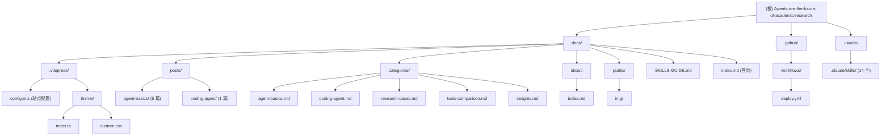

# CLAUDE.md - 项目索引文档

> 本文件由架构扫描自动生成，供 AI 助手快速理解项目全貌。人类开发者亦可作为项目导航参考。

## 变更记录 (Changelog)

| 日期 | 操作 | 说明 |
|------|------|------|
| 2026-02-14 | 增量更新 | 文章目录结构迁移（按分类组织）、新增 5 篇 Agent 基础文章、Skills 增至 14 个、侧边栏改为分类展示 |
| 2026-02-13 | 初始创建 | 首次全仓扫描，覆盖率 100% |

---

## 项目愿景

一个专注于分享 **Coding Agent（尤其是 LLM Coding Agent）在学术科研中的应用经验** 的技术博客。基于 VitePress 构建，部署于 GitHub Pages。目标受众为学术研究者和 AI 工具使用者。

- **在线地址**: https://hjnnjh.github.io/Agents-are-the-future-of-academic-research/
- **作者**: [@hjnnjh](https://github.com/hjnnjh)
- **许可**: 代码 MIT / 内容 CC BY-NC-SA 4.0

---

## 架构总览

本项目是一个**单模块 VitePress 静态博客站点**，无后端、无数据库、无微服务拆分。

| 层次 | 技术 | 说明 |
|------|------|------|
| 静态站点生成 | VitePress 1.5+ | 基于 Vite，极速构建 |
| 前端框架 | Vue 3.4+ | VitePress 内置 |
| 语言 | TypeScript / CSS / Markdown | 配置用 TS，内容用 MD |
| 图表 | Mermaid 11.x + vitepress-plugin-mermaid | 流程图/架构图 |
| 数学公式 | markdown-it-mathjax3 (KaTeX) | LaTeX 公式渲染 |
| 部署 | GitHub Actions -> GitHub Pages | push main 自动部署 |
| AI 工具链 | 14 个 Claude Code Skills | 写作/图表/质量/维护/审查 |

---

## 模块结构图

本项目为单模块结构，以下为目录拓扑：



---

## 模块索引

本项目为单体博客，无独立子模块。以下按功能区域列出：

| 功能区域 | 路径 | 说明 |
|----------|------|------|
| 站点配置 | `docs/.vitepress/config.mts` | VitePress 核心配置（导航/侧边栏/Markdown/SEO/Mermaid） |
| 自定义主题 | `docs/.vitepress/theme/` | 扩展默认主题 + 学术蓝配色 CSS |
| 首页 | `docs/index.md` | Hero 布局 + Features 卡片 |
| 博客文章 | `docs/posts/{category}/` | 按分类目录组织，含 frontmatter 元数据（共 6 篇） |
| 分类页 | `docs/categories/` | 5 大分类的索引页 |
| 关于页 | `docs/about/index.md` | 站点介绍与联系方式 |
| Skills 指南 | `docs/SKILLS-GUIDE.md` | 14 个 Claude Code Skills 的使用文档 |
| 静态资源 | `docs/public/img/` | Hero 图片（PNG） |
| CI/CD | `.github/workflows/deploy.yml` | GitHub Actions 自动构建部署 |
| Claude Skills | `.claude/skills/` | 14 个 SKILL.md 定义文件 |

---

## 运行与开发

### 环境要求

- Node.js >= 18.0.0 (推荐 20.x LTS)
- npm >= 9.0.0

### 常用命令

```bash
# 安装依赖
npm install

# 本地开发（热更新）
npm run dev          # -> http://localhost:5173

# 生产构建
npm run build        # 输出到 docs/.vitepress/dist/

# 预览构建结果
npm run preview      # -> http://localhost:4173

# 创建新文章（脚本未实现）
npm run new-post     # 引用 scripts/new-post.js，当前文件不存在
```

### 部署

- **自动部署**: 推送到 `main` 分支后，GitHub Actions 自动构建并部署到 GitHub Pages
- **base 路径**: `/Agents-are-the-future-of-academic-research/`
- **部署配置**: `.github/workflows/deploy.yml`

---

## 内容分类体系

博客内容分为 5 大类：

1. **Agent 基础** (`/categories/agent-basics`) - LLM Agent 核心概念与架构 [5 篇]
2. **Coding Agent 实践** (`/categories/coding-agent`) - Claude Code/OpenCode 深度技巧 [1 篇]
3. **学术科研案例** (`/categories/research-cases`) - 文献/数据/论文场景应用 [待填充]
4. **工具对比评测** (`/categories/tools-comparison`) - 横向对比与选型 [待填充]
5. **经验心得分享** (`/categories/insights`) - 踩坑记录与效率技巧 [待填充]

### 已发布文章清单

| 分类 | 文章 | 日期 |
|------|------|------|
| Agent 基础 | LLM Agent 简介 | 2026-02-13 |
| Agent 基础 | Agent 的记忆系统 | 2026-02-14 |
| Agent 基础 | 上下文工程 | 2026-02-15 |
| Agent 基础 | 多 Agent 协作 | 2026-02-16 |
| Agent 基础 | Agent 评估 | 2026-02-17 |
| Coding Agent 实践 | Agent Skills 使用入门 | 2026-02-10 |

---

## 文章写作规范

### 写作风格

- **深入浅出，不给读者带去认知负担**：用通俗易懂的语言解释复杂概念，避免堆砌术语，确保不同背景的读者都能顺畅阅读。

### 文章排序规则

- **按日期升序排列**：在分类页（`docs/categories/*.md`）和侧边栏（`config.mts` 的 `sidebar`）中，文章按发布日期从早到晚排列，新文章放在列表底部。首页"最新文章"列表除外，仍按倒序展示。

### Frontmatter 必填字段

```yaml
---
title: "文章标题"
date: YYYY-MM-DD
author: "作者名"
categories:
  - coding-agent        # 从 5 大分类选择
tags:
  - claude-code
  - tutorial
difficulty: beginner    # beginner / intermediate / advanced
summary: "50-200 字摘要"
featured: false         # 是否精选
---
```

### 文件命名

`docs/posts/{category}/YYYY-MM-DD-slug.md`

### 支持的 Markdown 增强

- LaTeX 数学公式（行内 `$...$`，独立块 `$$...$$`）
- Mermaid 流程图/架构图（` ```mermaid ` 代码块）
- 代码块行号与语法高亮（双主题：github-light / github-dark）
- VitePress 自定义容器（`:::tip`、`:::warning`、`:::danger`、`:::info`）
- 脚注（markdown-it-footnote）
- 任务列表（markdown-it-task-lists）

---

## 测试策略

本项目当前**无自动化测试**。验证方式：

- `npm run build` 构建成功即为基本验证
- `ignoreDeadLinks: false` 配置会在构建时检查死链
- 手动浏览器验证各页面功能

---

## 编码规范

- TypeScript 配置文件使用 `.mts` 后缀
- CSS 使用 VitePress 主题变量（`--vp-c-*`），支持深色/浅色模式
- Markdown 标题最多 4 级（H1-H4）
- 代码块必须标注语言
- 内部链接使用相对路径

---

## AI 使用指引

### 修改站点配置

核心文件: `docs/.vitepress/config.mts`
- 导航菜单: `themeConfig.nav`
- 侧边栏: `themeConfig.sidebar`（按分类分组展示，非按年份）
- 新增文章后需同步更新侧边栏配置

### 新增文章

1. 在 `docs/posts/{category}/` 下创建 `YYYY-MM-DD-slug.md`（category 为文章所属分类，如 `agent-basics`、`coding-agent`）
2. 填写完整 frontmatter
3. 在 `config.mts` 的 `sidebar['/posts/']` 对应分类组中添加条目（按日期升序，新文章放在该组末尾）
4. 在对应 `docs/categories/*.md` 中添加文章链接（按日期升序）
5. 在 `docs/index.md` 的"最新文章"列表顶部添加条目（按日期倒序）

### 修改主题样式

文件: `docs/.vitepress/theme/custom.css`
- 主色调为"学术蓝"（`#3B82F6`）
- 支持深色模式变量覆盖

### 已知问题

1. `scripts/new-post.js` 在 `package.json` 中引用但文件不存在
2. 3 个分类页（research-cases, tools-comparison, insights）内容为空占位

### Claude Code Skills

项目集成了 14 个 Claude Code Skills，定义在 `.claude/skills/` 目录下：

| 类别 | Skills |
|------|--------|
| 写作与内容 | markdown-tools, content-research-writer, prompt-optimizer, beautiful-prose |
| 技术工具 | mermaid-tools, changelog-generator, docs-cleaner |
| 设计展示 | ui-designer, cli-demo-generator |
| 文档与质量 | pdf-creator, fact-checker, skill-reviewer |
| 审查（只读） | content-reviewer, markdown-reviewer |

详细使用指南见 `docs/SKILLS-GUIDE.md`。
