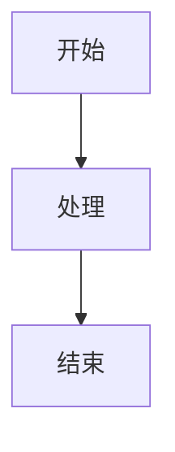

# AI Agent 学术科研实践博客

> LLM Agent（尤其是 Coding Agent）在学术研究中的应用经验分享

## 📚 项目简介

本项目是一个基于 VitePress 构建的技术博客，专注于分享 AI Agent 在学术科研领域的实践经验和使用心得。

**核心主题**:
- 🤖 LLM Agent 基础概念与原理
- 💻 Coding Agent 实践技巧
- 🔬 学术科研场景应用案例
- 🛠️ 工具对比与评测
- 💡 经验总结与心得分享

## 🚀 快速开始

### 环境要求

- Node.js 18+
- npm 9+ 或 pnpm 8+
- Git 2.x

### 安装依赖

```bash
# 安装项目依赖
npm install
```

### 本地开发

```bash
# 启动开发服务器
npm run dev

# 访问 http://localhost:5173
```

### 构建部署

```bash
# 构建生产版本
npm run build

# 预览构建结果
npm run preview
```

## 📁 项目结构

```
agents-academic-blog/
├── docs/                          # 博客源文件
│   ├── .vitepress/               # VitePress 配置
│   │   ├── config.ts             # 主配置文件
│   │   └── theme/                # 自定义主题
│   ├── posts/                    # 博客文章
│   │   └── 2025/                 # 按年份组织
│   ├── categories/               # 分类页面
│   ├── about/                    # 关于页面
│   └── index.md                  # 首页
├── scripts/                       # 工具脚本
│   └── new-post.js               # 创建新文章
├── .claude/                       # Claude Code Skills
│   └── skills/                   # 自定义技能
├── package.json
└── README.md
```

## ✍️ 写作指南

### 创建新文章

使用 npm 脚本快速创建：

```bash
npm run new-post
```

或手动创建文件 `docs/posts/YYYY/YYYY-MM-DD-title.md`，使用以下模板：

```markdown
---
title: "文章标题"
date: 2025-01-04
author: "作者名"
categories:
  - coding-agent
tags:
  - claude-code
  - tutorial
difficulty: intermediate
summary: "文章摘要"
featured: false
---

# 文章标题

## 摘要

<!-- 内容 -->
```

### 分类体系

- **agent-basics**: Agent 基础概念
- **coding-agent**: Coding Agent 实践
- **research-cases**: 学术科研案例
- **tools-comparison**: 工具对比
- **insights**: 经验心得

### Markdown 增强功能

#### 数学公式

```markdown
行内公式：$E = mc^2$

块级公式：
$$
\frac{\partial L}{\partial w} = \sum_{i=1}^{N} (y_i - \hat{y}_i) x_i
$$
```

#### 代码高亮

````markdown
```python {1,3-5}
def quick_sort(arr):
    if len(arr) <= 1:
        return arr
    # 核心逻辑
```
````

#### Mermaid 图表

````markdown

````

## 🛠️ Claude Code Skills

本项目集成了 **12 个专业 Skills** 全面提升写作效率:

### 📝 写作与内容创作 (4 个)

| Skill | 功能 | 优先级 |
|-------|------|--------|
| [markdown-tools](./.claude/skills/markdown-tools/SKILL.md) | Word/PDF/PPT → Markdown 转换 | ⭐⭐⭐⭐⭐ |
| [content-research-writer](./.claude/skills/content-research-writer/SKILL.md) | AI 驱动的研究写作 | ⭐⭐⭐⭐⭐ |
| [prompt-optimizer](./.claude/skills/prompt-optimizer/SKILL.md) | 优化 AI 提示词 | ⭐⭐⭐⭐ |
| [beautiful-prose](./.claude/skills/beautiful-prose/SKILL.md) | 语言风格润色 | ⭐⭐⭐ |

### 🛠️ 技术工具 (3 个)

| Skill | 功能 | 优先级 |
|-------|------|--------|
| [mermaid-tools](./.claude/skills/mermaid-tools/SKILL.md) | 快速生成流程图/架构图 | ⭐⭐⭐⭐⭐ |
| [changelog-generator](./.claude/skills/changelog-generator/SKILL.md) | Git 变更日志生成 | ⭐⭐⭐ |
| [docs-cleaner](./.claude/skills/docs-cleaner/SKILL.md) | 文档整理规范化 | ⭐⭐⭐ |

### 🎨 设计展示 (2 个)

| Skill | 功能 | 优先级 |
|-------|------|--------|
| [ui-designer](./.claude/skills/ui-designer/SKILL.md) | 设计系统提取 | ⭐⭐⭐⭐ |
| [cli-demo-generator](./.claude/skills/cli-demo-generator/SKILL.md) | CLI 演示动画 | ⭐⭐⭐ |

### 📄 文档处理 + ✅ 质量保证 (3 个)

| Skill | 功能 | 优先级 |
|-------|------|--------|
| [pdf-creator](./.claude/skills/pdf-creator/SKILL.md) | 生成专业 PDF | ⭐⭐⭐⭐ |
| [fact-checker](./.claude/skills/fact-checker/SKILL.md) | 事实验证 | ⭐⭐⭐⭐ |
| [skill-reviewer](./.claude/skills/skill-reviewer/SKILL.md) | Skills 质量审查 | ⭐⭐⭐ |

📚 **详细文档**:
- [Skills 总览](./.claude/skills/README.md) - 所有 skills 完整文档
- [使用指南](./docs/SKILLS-GUIDE.md) - 场景化工作流和最佳实践
- [原设计文档](./docs/claude-code-skills-design.md) - 项目初始规划

## 📖 技术文档

### 核心文档

- **[完整项目指南](PROJECT-COMPLETE-GUIDE.md)** ⭐ - 一站式完整指南,整合所有关键信息
- [技术架构设计文档](docs/tech-architecture.md) - 技术选型和架构设计
- [Claude Code Skills 设计文档](docs/claude-code-skills-design.md) - 原始 Skills 设计
- [项目初始化指南](docs/initialization-guide.md) - 详细搭建步骤

### Skills 相关

- [Skills 使用指南](docs/SKILLS-GUIDE.md) - 场景化使用教程
- [Skills 安装总结](docs/SKILLS-INSTALLATION-SUMMARY.md) - 安装概览和快速开始

## 🚀 部署

本项目使用 GitHub Actions 自动部署到 GitHub Pages。

### 部署步骤

1. **推送到 GitHub**:
   ```bash
   git add .
   git commit -m "feat: add new post"
   git push origin main
   ```

2. **自动部署**: GitHub Actions 会自动构建并部署到 `gh-pages` 分支

3. **访问网站**: `https://yourusername.github.io/agents-academic-blog/`

### 配置 GitHub Pages

1. 进入仓库 Settings → Pages
2. Source 选择 "GitHub Actions"
3. 等待部署完成

## 📊 项目路线图

- [x] 技术架构设计
- [x] Claude Code Skills 设计
- [ ] 初始化 VitePress 项目
- [ ] 创建首个示例文章
- [ ] 实现 Skills 脚本
- [ ] 配置 GitHub Actions
- [ ] 发布第一版

## 🤝 贡献指南

欢迎贡献内容和改进建议！

1. Fork 本仓库
2. 创建特性分支 (`git checkout -b feature/amazing-post`)
3. 提交更改 (`git commit -m 'feat: add amazing post'`)
4. 推送到分支 (`git push origin feature/amazing-post`)
5. 创建 Pull Request

## 📄 许可证

本项目采用 MIT 许可证 - 详见 [LICENSE](LICENSE) 文件

内容采用 [CC BY-NC-SA 4.0](https://creativecommons.org/licenses/by-nc-sa/4.0/) 许可

## 📮 联系方式

- GitHub: [@yourusername](https://github.com/yourusername)
- Email: your.email@example.com

---

**Built with** ❤️ **using VitePress and Claude Code**
