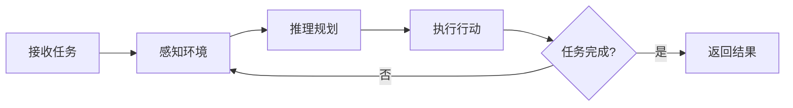
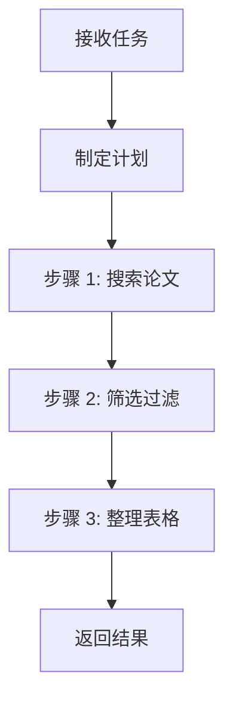

::: warning AI 含量说明
本文由 AI (Claude) 辅助生成，内容经过人工审核与编辑。部分描述可能存在简化表述，请读者结合实际使用体验参考。
:::

# LLM Agent 到底是什么？一文搞懂核心概念

::: info 本文概览
- 🎯 **目标读者**: 对 Agent 概念感兴趣的入门者
- ⏱️ **阅读时间**: 约 8 分钟
- 📚 **知识要点**: Agent 定义、与普通 LLM 的区别、核心架构、主流模式
:::

## 从一个问题说起

你一定用过 ChatGPT 或 Claude 这样的大语言模型（LLM）：你问一个问题，它回答你，结束。

但如果你让它"帮我调研最近三个月关于 xxx 的论文，整理成表格"呢？单次对话显然不够——它需要**搜索、阅读、筛选、整理**，一步步地完成任务。

这就是 **Agent** 要解决的问题。

## Agent 与普通 LLM 调用的区别

一句话概括：**LLM 只是大脑，Agent 是一个有手有脚的人**。

LLM 再聪明，它只能"想"和"说"——你问它怎么分析数据，它能给你一份漂亮的方案，但它没法真的去执行。而 Agent 不一样，它不仅能想，还能**动手做**：搜索网页、读写文件、运行代码、调用 API。大脑加上手脚，才是一个能干活的人。

| 维度 | LLM（大脑） | Agent（完整的人） |
|------|-------------|-----------------|
| 能力 | 只能思考和生成文本 | 能思考，也能动手操作 |
| 工具 | 无 | 搜索、代码执行、API 调用等 |
| 决策权 | 用户决定每一步 | 自主决定下一步做什么 |
| 执行方式 | 一问一答 | 自主循环，直到任务完成 |

Anthropic 在其[官方文档](https://www.anthropic.com/research/building-effective-agents)中给出了一个关键区分：

- **工作流（Workflow）**：LLM 按预定义的固定路径执行——你写好了剧本，它只是演
- **Agent**：LLM **动态自主决定**自己的执行路径——你给它目标，它自己写剧本并演出来

## Agent 的核心架构

不管多复杂的 Agent，本质上都是一个**循环**：



拆开来看就三件事：

1. **感知**：获取当前环境信息（读文件、搜索网页、查数据库……）
2. **推理**：基于已有信息决定下一步做什么
3. **行动**：调用工具执行具体操作（写代码、调 API、生成文本……）

这个循环不断重复，直到任务完成。其中，**工具调用**是 Agent 区别于普通 LLM 的关键能力。没有工具，LLM 只能"想"；有了工具，Agent 才能"做"。

::: tip 类比理解
把 Agent 想象成一个实习生：你给他一个任务，他会自己查资料（感知）、想方案（推理）、动手做（行动），做完一步看看效果，再决定下一步。而普通 LLM 更像一个只能口头回答问题的顾问。
:::

## 三种主流 Agent 模式

### 1. ReAct：边想边做

**ReAct**（Reasoning + Acting）是最经典的 Agent 模式，核心思想很简单：

> 想一步 → 做一步 → 看结果 → 再想下一步

```
思考: 用户要找关于 X 的论文，我先搜索一下
行动: 调用搜索工具，查询 "X recent papers"
观察: 找到了 15 篇相关论文
思考: 结果太多，我筛选最近 3 个月的
行动: 过滤日期……
```

**优点**：灵活、可解释——你能看到它每一步在"想什么"。

**缺点**：每一步都要调用 LLM 推理，速度慢、成本高。

### 2. Plan-and-Execute：先规划再执行

与 ReAct 的"走一步看一步"不同，这个模式是**先制定完整计划，再逐步执行**：



**优点**：执行效率高，子步骤可以用更小的模型完成。

**缺点**：计划一旦制定，遇到意外情况不太好调整。

### 3. 混合模式：实践中最常用

现实中的 Agent 通常**混合使用**多种模式。Anthropic 总结了五种常见的实用模式：

| 模式 | 一句话说明 |
|------|----------|
| **提示链** | 固定步骤序列，A → B → C |
| **路由** | 先分类输入，再导向不同处理流程 |
| **并行化** | 多个 LLM 同时工作，汇总结果 |
| **编排-工作者** | 一个"经理"动态分配任务给多个"员工" |
| **评估-优化** | 一个生成，一个评判，循环改进 |

::: info Anthropic 的核心建议
从最简单的方案开始，只在必要时增加复杂度。很多场景下甚至不需要构建 Agent 系统——一个好的 Prompt 可能就够了。
:::

## Agent 在学术研究中能做什么？

回到我们关心的场景——学术研究。Agent 的能力正好契合研究中的多步骤、多工具任务：

- **文献调研**：自主搜索、筛选、整理论文，生成综述表格
- **数据分析**：读取数据、选择合适的统计方法、执行分析、生成可视化
- **代码实现**：根据算法描述编写代码、调试、运行实验
- **论文写作**：辅助组织结构、润色语言、检查引用格式

而 **Coding Agent**（如 Claude Code、Cursor）是目前最成熟的 Agent 形态之一——它把"写代码"这个场景做到了极致，也是本博客重点关注的方向。

## 总结

三个要点带走：

1. **Agent = LLM + 工具 + 自主循环**，能动态决定执行路径
2. **核心架构**是"感知→推理→行动"的循环，工具调用是关键能力
3. **不要过度设计**——从简单方案开始，按需增加复杂度

## 参考资料

- [Anthropic: Building Effective Agents](https://www.anthropic.com/research/building-effective-agents)
- [OpenAI: A Practical Guide to Building Agents](https://cdn.openai.com/building-agentic-experiences-a-practical-guide.pdf)
- [ReAct: Synergizing Reasoning and Acting in Language Models (Yao et al., 2022)](https://arxiv.org/abs/2210.03629)
- [Toolformer: Language Models Can Teach Themselves to Use Tools (Schick et al., 2023)](https://arxiv.org/abs/2302.04761)
