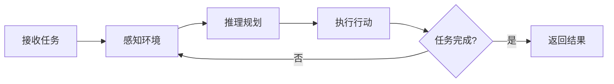
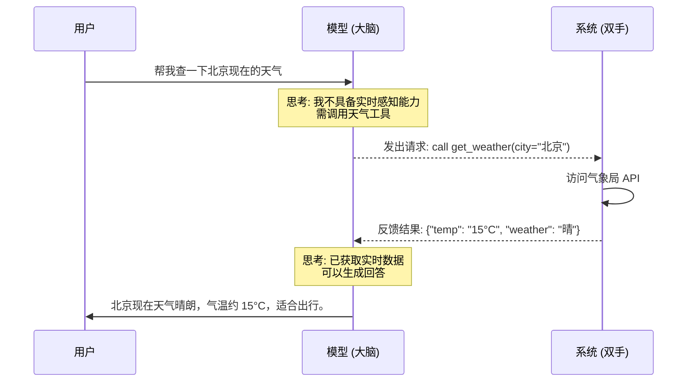
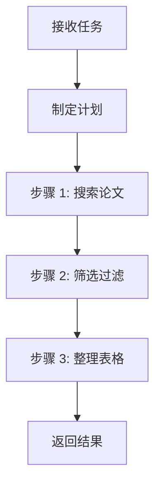

::: warning AI 含量说明
本文由 AI (Claude) 辅助生成，内容经过人工审核与编辑。部分描述可能存在简化表述，请读者结合实际使用体验参考。
:::

# LLM Agent 简介

::: info 本文概览

- 🎯 **目标读者**: 对 Agent 概念感兴趣的入门者
- ⏱️ **阅读时间**: 约 10 分钟
- 📚 **知识要点**: Agent 定义、与普通 LLM 的区别、Function Call 机制、核心架构、主流模式
  :::

## 从一个问题说起

你一定用过 ChatGPT 或 Claude 这样的大语言模型（LLM）：你问一个问题，它回答你，结束。

但如果你让它"帮我调研最近三个月关于 xxx 的论文，整理成表格"呢？单次对话显然不够——它需要 **搜索、阅读、筛选、整理**，一步步地完成任务。

这就是 **Agent** 要解决的问题。

## Agent 与普通 LLM 调用的区别

一句话概括：**LLM 只是大脑，Agent 是一个有手有脚的人**。

LLM 再聪明，它只能"想"和"说"——你问它怎么分析数据，它能给你一份漂亮的方案，但它没法真的去执行。而 Agent 不一样，它不仅能想，还能 **动手做**：搜索网页、读写文件、运行代码、调用 API。大脑加上手脚，才是一个能干活的人。

| 维度     | LLM（大脑）        | Agent（完整的人）          |
| -------- | ------------------ | -------------------------- |
| 能力     | 只能思考和生成文本 | 能思考，也能动手操作       |
| 工具     | 无                 | 搜索、代码执行、API 调用等 |
| 决策权   | 用户决定每一步     | 自主决定下一步做什么       |
| 执行方式 | 一问一答           | 自主循环，直到任务完成     |

Anthropic 在其 [官方文档](https://www.anthropic.com/research/building-effective-agents) 中给出了一个关键区分：

- **工作流（Workflow）**：LLM 按预定义的固定路径执行——你写好了剧本，它只是演
- **Agent**：LLM **动态自主决定** 自己的执行路径——你给它目标，它自己写剧本并演出来

## Agent 的核心架构

不管多复杂的 Agent，本质上都是一个 **循环**：



拆开来看就三件事：

1. **感知**：获取当前环境信息（读文件、搜索网页、查数据库……）
2. **推理**：基于已有信息决定下一步做什么
3. **行动**：调用工具执行具体操作（写代码、调 API、生成文本……）

这个循环不断重复，直到任务完成。其中，**工具调用**是 Agent 区别于普通 LLM 的关键能力。没有工具，LLM 只能"想"；有了工具，Agent 才能"做"。

::: tip 类比理解
把 Agent 想象成一个实习生：你给他一个任务，他会自己查资料（感知）、想方案（推理）、动手做（行动），做完一步看看效果，再决定下一步。而普通 LLM 更像一个只能口头回答问题的顾问。
:::

## Function Call：让 Agent 真正"动手"的关键

上面我们说 Agent 能"动手做"，但具体怎么做呢？答案就是 **Function Call（函数调用）**——大模型与外部世界交互的标准协议。

在 Function Call 出现之前，大模型仅能"空谈"。有了它，模型在思考过程中一旦察觉信息缺失或需要执行操作，便能主动发出请求："**我需要调用这个工具，参数如下，请帮我执行并反馈结果。**"

### 类比：你和你的私人管家

想象你雇佣了一位数字管家：

1. **你**："我饿了，帮我点一份附近评分最高的披萨。"
2. **管家（LLM 大脑）**：
   - _思考_：我需要定位用户坐标，并搜索周边的披萨店。
   - _决策_：调用 `search_nearby_restaurants` 工具。
3. **系统（执行层）**：执行搜索，反馈一份餐厅列表及评分。
4. **管家（LLM 大脑）**：
   - _思考_：分析列表，发现"披萨大王"评分 4.9，最高。
   - _决策_：调用 `place_order` 工具，指定餐厅和单品。
5. **系统（执行层）**：下单成功，返回订单编号。
6. **管家**："已为您订购了'披萨大王'的招牌披萨，订单号 9527，预计 30 分钟送达。"

在这个闭环中，LLM 负责**逻辑决策**（分析意图、选择工具），而底层代码负责**物理执行**。

### 一个更技术的例子

下面这个序列图展示了 Function Call 在一次简单查天气任务中的完整流程：



### Function Call 为什么重要？

如果说 **Prompt Engineering** 是在磨练大模型的"口才"，那么 **Function Call** 就是在赋予大模型"行动力"。它打破了模型的"围墙"：

- **时效性重构**：通过搜索工具获取秒级更新的资讯
- **数据孤岛打通**：通过数据库接口读取企业内部的实时报表
- **物理世界触达**：发送邮件、操作日程、甚至控制实验室的机械臂

当一个模型学会了在恰当的时机选择恰当的工具，它就不再只是一个聊天窗口，而是一个能够闭环解决问题的 **AI Agent**。

## 三种主流 Agent 模式

### 1. ReAct：边想边做

**ReAct**（Reasoning + Acting）是最经典的 Agent 模式，核心思想很简单：

> 想一步 → 做一步 → 看结果 → 再想下一步

```
思考: 用户要找关于 X 的论文，我先搜索一下
行动: 调用搜索工具，查询 "X recent papers"
观察: 找到了 15 篇相关论文
思考: 结果太多，我筛选最近 3 个月的
行动: 过滤日期……
```

**优点**：灵活、可解释——你能看到它每一步在"想什么"。

**缺点**：每一步都要调用 LLM 推理，速度慢、成本高。

### 2. Plan-and-Execute：先规划再执行

与 ReAct 的"走一步看一步"不同，这个模式是**先制定完整计划，再逐步执行**：



**优点**：执行效率高，子步骤可以用更小的模型完成。

**缺点**：计划一旦制定，遇到意外情况不太好调整。

### 3. 混合模式：实践中最常用

现实中的 Agent 通常**混合使用**多种模式。Anthropic 总结了五种常见的实用模式：

| 模式            | 一句话说明                         |
| --------------- | ---------------------------------- |
| **提示链**      | 固定步骤序列，A → B → C            |
| **路由**        | 先分类输入，再导向不同处理流程     |
| **并行化**      | 多个 LLM 同时工作，汇总结果        |
| **编排-工作者** | 一个"经理"动态分配任务给多个"员工" |
| **评估-优化**   | 一个生成，一个评判，循环改进       |

::: info Anthropic 的核心建议
从最简单的方案开始，只在必要时增加复杂度。很多场景下甚至不需要构建 Agent 系统——一个好的 Prompt 可能就够了。
:::

## Agent 在学术研究中能做什么？

回到我们关心的场景——学术研究。Agent 的能力正好契合研究中的多步骤、多工具任务：

- **文献调研**：自主搜索、筛选、整理论文，生成综述表格
- **数据分析**：读取数据、选择合适的统计方法、执行分析、生成可视化
- **代码实现**：根据算法描述编写代码、调试、运行实验
- **论文写作**：辅助组织结构、润色语言、检查引用格式

而 **Coding Agent**（如 Claude Code、OpenCode、Cursor等）是目前最成熟的 Agent 形态之一——它把"写代码"这个场景做到了极致，事实上很多人（包括作者本人）认为 Coding Agent本质上就是通用Agent，这也是本博客重点关注的方向。

## 总结

三个要点带走：

1. **Agent = LLM + 工具 + 自主循环**，能动态决定执行路径
2. **Function Call 是关键桥梁**——让模型从"只能说"进化到"能动手"，是 Agent 的技术基石
3. **不要过度设计**——从简单方案开始，按需增加复杂度

## 参考资料

- [Anthropic: Building Effective Agents](https://www.anthropic.com/research/building-effective-agents)
- [OpenAI: A Practical Guide to Building Agents](https://cdn.openai.com/building-agentic-experiences-a-practical-guide.pdf)
- [ReAct: Synergizing Reasoning and Acting in Language Models (Yao et al., 2022)](https://arxiv.org/abs/2210.03629)
- [Toolformer: Language Models Can Teach Themselves to Use Tools (Schick et al., 2023)](https://arxiv.org/abs/2302.04761)
