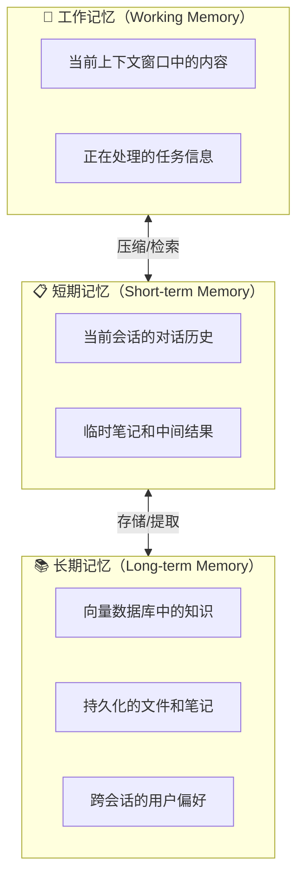
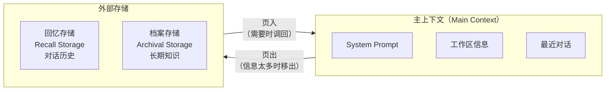
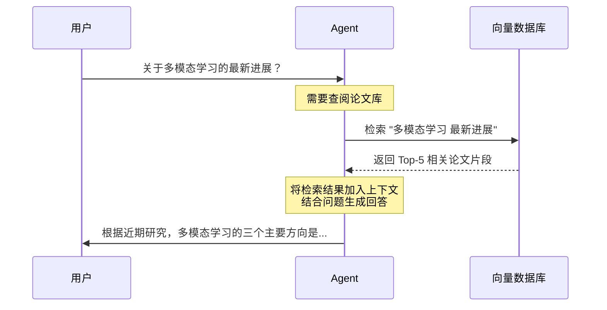
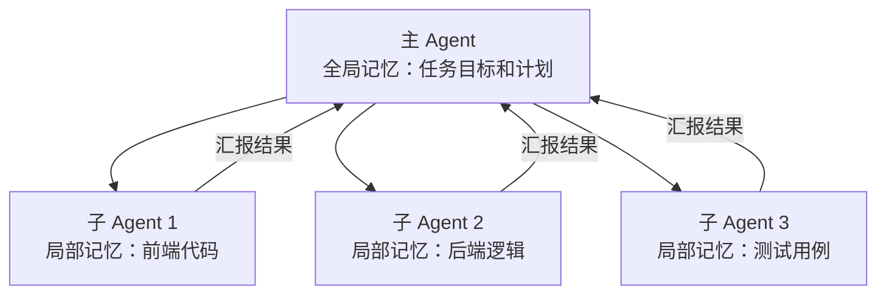

::: warning AI 含量说明
本文由 AI (Claude) 辅助生成，内容经过人工审核与编辑。部分描述可能存在简化表述，请读者结合实际使用体验参考。
:::

# Agent 的记忆系统

::: info 本文概览

- 🎯 **目标读者**: 了解 Agent 基础概念、希望深入理解记忆机制的读者
- ⏱️ **阅读时间**: 约 12 分钟
- 📚 **知识要点**: 记忆三层架构、上下文窗口限制、MemGPT 虚拟记忆、RAG 检索增强、学术场景应用
- 📌 **前置阅读**: [LLM Agent 简介](/posts/agent-basics/2026-02-13-llm-agent-basics)
  :::

## 一个真实的困境

你正在用 AI 助手做一项文献综述。前三天一切顺利——它记得你的研究主题是"多模态学习在医学影像中的应用"，知道你已经筛选了 47 篇论文，甚至记得你偏好 2022 年以后的研究。

第四天，你打开新对话，发现它什么都不记得了。你不得不重新解释一遍研究背景、筛选标准、已有进展……

这不是 AI 的"健忘"——这是 **记忆系统设计** 的问题。理解 Agent 如何管理记忆，是让 AI 真正成为你长期科研伙伴的关键。

## 为什么 Agent 需要记忆？

在 [上一篇文章](/posts/agent-basics/2026-02-13-llm-agent-basics) 中，我们讲了 Agent 的核心循环：感知 → 推理 → 行动。但有一个关键问题被简化了：**Agent 在推理时，依据的是什么信息？**

答案是 **上下文（Context）**——也就是模型在推理时能"看到"的全部信息。没有足够的上下文，再聪明的大脑也做不出好的决策。

但问题来了：LLM 的上下文窗口是**有限的**。

| 模型            | 上下文窗口             | 大约相当于               |
| --------------- | ---------------------- | ------------------------ |
| GPT-5.2         | 400K tokens            | ~1000 页文档             |
| Claude Opus 4.6 | 200K tokens（Beta 1M） | ~500 页（Beta ~2500 页） |
| Gemini 3 Pro    | 1M tokens              | ~2500 页文档             |

看起来很大？但在真实的研究场景中，当你处理几十篇论文、数千行代码、多轮对话历史时，上下文窗口很快就会被填满。更重要的是，**窗口越大，模型对信息的"注意力"就越分散**——塞进去 500 页文档，模型反而可能忽略关键信息。

::: tip 类比理解
上下文窗口就像你的书桌面积。桌子再大，堆满了文件时你也很难找到需要的那一页。好的记忆系统不是"把所有东西都堆在桌上"，而是**把最需要的东西放在手边，其余的放在书架上，需要时再取**。
:::

这就是 Agent 记忆系统要解决的核心问题：**如何在有限的上下文窗口中，管理无限增长的信息？**

## 记忆的三层架构

借鉴认知科学对人类记忆的分类，我们可以将 Agent 的记忆分为三层：

### 第一层：工作记忆——"桌面上正在看的"

工作记忆就是当前上下文窗口中的内容。它容量有限但读写极快，是 Agent 推理决策的**直接依据**。

工作记忆中通常包含：

- **系统提示词（System Prompt）**：定义 Agent 的角色和行为规则
- **当前对话上下文**：最近几轮的用户输入和 Agent 回复
- **工具调用结果**：最近一次搜索、代码执行等操作的返回值
- **任务状态**：当前进行到哪一步、还剩什么要做

工作记忆的关键挑战是**信息淘汰**：当上下文窗口快要满时，哪些信息该保留，哪些该丢弃？

### 第二层：短期记忆——"今天的笔记本"

短期记忆存储**当前会话**的完整信息，但不是全部塞进上下文窗口。常见的管理策略：

**滑动窗口（Sliding Window）**：只保留最近 N 轮对话，早期对话被丢弃。简单但粗暴——你可能丢掉第一轮对话中的关键约束条件。

**摘要压缩（Summary Compaction）**：定期将长对话压缩为简短摘要。例如将 20 轮对话压缩为一段 200 字的要点。保留了关键信息，但压缩本身会损失细节。

**结构化笔记（Structured Notes）**：Agent 在工作过程中主动记录关键信息，形成结构化的"工作笔记"。这是 Anthropic 推荐的方法，Claude Code 就采用了类似策略。

::: info Anthropic 的"结构化笔记"方法
Anthropic 在 [Building Effective Agents](https://www.anthropic.com/research/building-effective-agents) 中建议 Agent 维护一份结构化的"暂存空间（scratchpad）"，在每次行动后更新关键发现和待办事项。这让 Agent 即使在长任务中也能保持对全局的把握。
:::

### 第三层：长期记忆——"书架上的档案"

长期记忆存储**跨会话**的持久化信息，让 Agent 在不同对话之间保持连贯。常见实现方式：

| 方式            | 原理                               | 优势                 | 适用场景           |
| --------------- | ---------------------------------- | -------------------- | ------------------ |
| **向量数据库**  | 将文本转为向量嵌入，通过相似度检索 | 语义搜索、大规模知识 | 论文库、知识库     |
| **文件系统** ⭐ | 将记忆写入文件（Markdown、JSON 等） | 可读性强、易编辑     | 项目笔记、偏好配置 |
| **关系数据库**  | 结构化存储事实和关系               | 精确查询、关系推理   | 实体关系、实验记录 |
| **知识图谱**    | 以图结构存储实体和关系             | 多跳推理、关联发现   | 文献网络、概念地图 |

::: tip 笔者经验
文件系统是笔者最常用的跨会话信息持久化方式。在复杂模型设计方案的落地、实验分析方案的实现等场景中，我会让 Agent 将关键决策、设计思路和阶段性结论写入 Markdown 文件。下次开启新会话时，Agent 读取这些文件即可快速恢复上下文，无需重新解释整个项目背景。这种方式简单、透明，且人类可以随时审阅和修改 Agent 的"记忆"。
:::

## MemGPT：像操作系统一样管理记忆 {#memgpt}

::: details 📖 选读内容（点击展开）
本节介绍 MemGPT 的虚拟内存管理思想，对理解记忆架构设计有帮助，但不影响后续阅读。如果你主要关注实践应用，可以跳过。
:::

2023 年，UC Berkeley 的研究团队提出了 **MemGPT**（现已更名为 Letta），这是目前最有影响力的 Agent 记忆管理方案之一。

MemGPT 的核心洞察：**把 LLM 的上下文窗口类比为操作系统的内存，用虚拟内存的思想来管理它**。

就像操作系统在内存不够时把数据换到磁盘一样，MemGPT 让 Agent 能够：

1. **自主决定** 什么信息该留在主上下文中
2. **主动存档**暂时不需要的信息到外部存储
3. **按需检索**之前存档的信息回到工作区

关键在于：这些操作由 Agent **自己发起**，而不是由程序硬编码的规则控制。Agent 学会了"管理自己的记忆"。

::: tip 为什么这很重要？
传统方法（如滑动窗口）是"被动遗忘"——信息按时间顺序被丢弃，不管重不重要。MemGPT 实现了"主动管理"——Agent 自己判断哪些信息重要，该保留还是存档。这更接近人类大脑的工作方式。
:::

## RAG：从外部知识库"回忆" {#rag}

::: details 📖 选读内容（点击展开）
本节介绍 RAG 的原理与 Agentic RAG 的演进。如果你已经熟悉 RAG，可以跳过直接阅读后面的实际案例。
:::

**RAG (Retrieval-Augmented Generation，检索增强生成)** 是目前最广泛使用的长期记忆实现方案。它的核心思路很直接：

> 不要把所有知识都塞进上下文窗口，而是**在需要时检索相关信息**。

RAG 的工作流程：

1. **索引阶段**：将文档切分为片段，转为向量嵌入，存入向量数据库
2. **检索阶段**：用户提问时，将问题转为向量，搜索最相似的文档片段
3. **生成阶段**：将检索到的片段注入上下文，让 LLM 基于这些信息生成回答

从记忆的角度看，RAG 本质上就是**长期记忆的检索机制**。向量数据库是"书架"，嵌入向量是"书签"，检索过程是"翻找档案"。

### Agent + RAG = 主动检索

在传统 RAG 中，检索通常由用户的提问触发。但在 Agent 架构中，Agent 可以**主动决定何时检索**：

- 发现知识缺口时自动搜索
- 在规划阶段检索相关案例
- 在验证阶段检索事实数据

这种"Agent 驱动的 RAG"（Agentic RAG）比传统 RAG 更灵活，因为 Agent 可以：

- 多次迭代检索，逐步缩小范围
- 根据中间结果调整检索策略
- 综合多个来源的信息做出判断

## 实际案例：Claude Code 的记忆策略 {#claude-code}

::: details 📖 选读内容（点击展开）
本节以 Claude Code 为例剖析真实产品中的记忆策略实现，适合对 Coding Agent 内部机制感兴趣的读者。
:::

作为目前最成熟的 Coding Agent 之一，Claude Code 的记忆管理设计值得我们学习：

### CLAUDE.md：项目级长期记忆

Claude Code 使用 `CLAUDE.md` 文件作为项目级别的持久化记忆。每次启动时自动加载，包含：

- 项目的技术栈和架构信息
- 编码规范和风格偏好
- 常用命令和工作流程
- 已知问题和注意事项

这本质上是一种**文件系统实现的长期记忆**——简单、透明、可人工编辑。

### 上下文压缩：对抗遗忘

当对话变长、上下文窗口接近上限时，Claude Code 会触发**上下文压缩（Compaction）**：将之前的长对话自动总结为精炼的要点，释放上下文空间给新的任务。

这相当于"把桌上堆积的笔记整理成一页摘要"，保留了关键信息，同时为新工作腾出空间。

### 子 Agent 架构：分布式记忆

面对复杂任务，Claude Code 可以将工作分配给子 Agent。每个子 Agent 有自己独立的上下文窗口，相当于**分布式记忆**——每个"助手"记住自己负责的那部分信息，最后汇总结果给主 Agent。

## 在学术研究中，记忆能帮你什么？

理解了 Agent 的记忆机制，我们来看看它在学术场景中的具体价值：

### 1. 文献综述的跨会话连续性

通过长期记忆（如 CLAUDE.md 或向量数据库），Agent 可以跨多次对话记住：

- 你的研究主题和筛选标准
- 已经读过的论文列表和关键发现
- 待深入分析的论文队列

### 2. 实验记录的自动追踪

Agent 的结构化笔记能力可以自动记录：

- 每次实验的参数配置
- 运行结果和性能指标
- 失败案例和调试过程

### 3. 代码项目的上下文理解

在 Coding Agent 场景下，项目级记忆让 Agent 能够：

- 记住项目的整体架构和技术栈
- 了解编码规范和命名约定
- 追踪已修复的 Bug 和待办事项

### 4. 多轮研究对话的连贯性

通过短期记忆管理，Agent 在同一次长对话中能够：

- 记住前面讨论过的思路和结论
- 保持对复杂推理链条的跟踪
- 在切换话题后还能回到之前的讨论

## 总结

三个要点带走：

1. **Agent 的记忆分三层**：工作记忆（上下文窗口）、短期记忆（会话内）、长期记忆（跨会话），各层通过压缩和检索相互连接
2. **核心挑战是"有限窗口 vs 无限信息"**——好的记忆系统不是记住所有东西，而是**在正确的时间提供正确的信息**
3. **RAG 是目前最实用的长期记忆方案**——通过向量检索让 Agent 按需"回忆"，而 MemGPT 的虚拟记忆思想代表了更自主的未来方向

## 参考资料

- [MemGPT: Towards LLMs as Operating Systems (Packer et al., 2023)](https://arxiv.org/abs/2310.08560)
- [Anthropic: Building Effective Agents](https://www.anthropic.com/research/building-effective-agents)
- [Retrieval-Augmented Generation for Knowledge-Intensive NLP Tasks (Lewis et al., 2020)](https://arxiv.org/abs/2005.11401)
- [A Survey on Large Language Model based Autonomous Agents (Wang et al., 2023)](https://arxiv.org/abs/2308.11432)
- [Cognitive Architectures for Language Agents (CoALA) (Sumers et al., 2023)](https://arxiv.org/abs/2309.02427)
