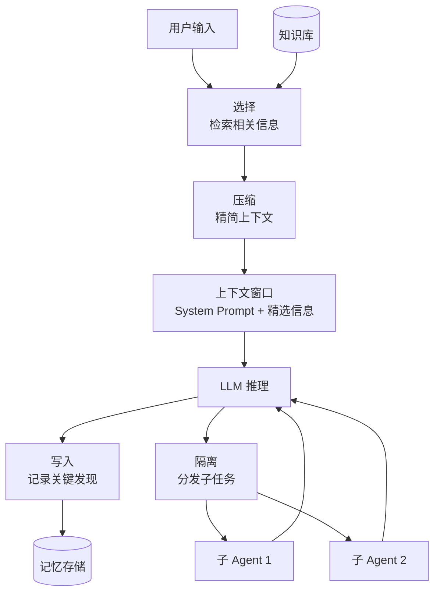

::: warning AI 含量说明
本文由 AI (Claude) 辅助生成，内容经过人工审核与编辑。部分描述可能存在简化表述，请读者结合实际使用体验参考。
:::

# 上下文工程：从 Prompt Engineering 到 Context Engineering

::: info 本文概览

- 🎯 **目标读者**: 了解 Agent 基础概念、希望提升 Agent 效果的读者
- ⏱️ **阅读时间**: 约 15 分钟
- 📚 **知识要点**: Prompt Engineering 局限、Context Engineering 定义、上下文构建四大策略、Scratchpad 实践、学术场景应用
- 📌 **前置阅读**: [LLM Agent 简介](/posts/agent-basics/2026-02-13-llm-agent-basics), [Agent 的记忆系统](/posts/agent-basics/2026-02-14-agent-memory-systems)
:::

## 一个关于“完美提示词”的挫败故事

张博士正在进行一项关于“固态电池电解质”的文献综述。为了让他的科研 Agent 表现出色，他花费了整个下午打磨提示词。

他使用了所有已知的 Prompt Engineering 技巧：**Role-playing**（“你是一位顶尖材料科学家”）、**Few-shot**（提供了三个完美的综述范例）、**Chain-of-Thought**（“请一步步思考并分析”），甚至加上了“这对我的职业生涯至关重要”这种情绪诱导。

然而，当他把包含 50 篇论文摘要的文件传给 Agent 后，结果却令人大失所望。Agent 变得极其混乱，遗漏了最重要的几篇最新文献，还把两个完全不同的实验参数搞混了。

张博士很困惑：“我的提示词写得近乎完美，模型也是最强的，为什么它还是表现得像个笨蛋？”

原因很简单：**张博士做好了 Prompt Engineering，却彻底忽略了 Context Engineering。** 他试图一次性把所有信息“塞进”模型的嘴里，导致模型在海量噪声中失去了注意力焦点。在学术研究这种高信息密度的场景中，如何“提问”只是冰山一角，如何“管理模型看到的一切信息”才是决定胜负的关键。

后来，张博士学会了**上下文隔离**。他不再让 Agent 一次性读 50 篇，而是通过任务解耦，让一个子 Agent 专门负责信息筛选，并将结果写入一个持久化的 Markdown 表格。当他再次启动写作任务时，Agent 看到的不再是 50 篇混乱的摘要，而是一个结构化、极度精简且高价值的上下文。结果是——一份高质量的文献综述只用了不到一小时就初具雏形。

## 从 Prompt Engineering 说起

我们都熟悉 **Prompt Engineering（提示工程）**。它是 LLM 时代的先行者，核心在于**如何通过文字描述来激发模型的能力**。

在 Agent 的初级阶段，Prompt Engineering 确实非常管用。通过清晰的指令和例子，我们能显著提升模型的输出质量。但随着任务复杂度的提升，其局限性开始显现：

1. **只关注“如何问”，忽略“看什么”**：模型推理不仅靠指令，更靠数据。如果输入的信息（Context）本身充满噪声，指令再优雅也无济于事。
2. **单次交互视角**：Prompt Engineering 往往针对单次提问。但在 Agent 的多轮工作流中，上下文是动态变化的，静态的提示词无法应对长周期的任务。
3. **不可扩展性**：当你有 100 篇论文需要处理时，你不可能把它们全部塞进一个静态的 Prompt 里。

Spring AI Alibaba 团队曾提出过一个深刻的观察：“**LLM 的失败，20% 是由于底层模型能力不足，而 80% 是由于开发者没有传递正确的上下文。**”

为什么这个比例如此悬殊？因为在真实世界的任务中，LLM 就像是一个在一个充满迷雾的房间里工作的超级天才。无论这个天才多么聪明（模型能力），如果房间里光线昏暗（上下文混乱）、到处是干扰音（上下文噪声）、且桌子上的参考资料杂乱无章（上下文缺乏组织），他也很难完成一项高质量的学术任务。

通过 Context Engineering，我们的本质工作就是**为 LLM “拨开迷雾”**。我们通过精确的检索来“提亮光线”，通过信息过滤来“消除噪音”，并通过结构化的编排来“整理桌面”。当这些基础工作做到位时，哪怕是中等性能的模型（如 GPT-4o-mini 或 Claude Haiku），也能在特定任务上超越缺乏上下文管理的最强模型。

## 什么是上下文工程？

如果说 Prompt Engineering 是“写作的艺术”，那么 **Context Engineering（上下文工程）** 就是“系统设计的科学”。

前 OpenAI 科学家 Andrej Karpathy 在 2025 年 6 月给出了他的定义：
> “Context engineering is the delicate art and science of filling the context window with just the right information for the next step.”
> （上下文工程是一门精细的艺术与科学，旨在为接下来的每一步推理，在上下文窗口中填充最准确的信息。）

Anthropic 则从技术层面定义上下文：**上下文是采样（推理）时包含的所有 Token 集合。**

### 记忆是存储，上下文工程是编排

在 [上一篇文章](/posts/agent-basics/2026-02-14-agent-memory-systems) 中，我们讨论了 Agent 的记忆系统。如果说记忆系统是解决“如何存”和“存哪里”的底层架构，那么**上下文工程就是决定在特定时刻，从记忆库中提取哪些信息，并以何种形式呈现在模型面前。**

以下是两者在多个维度的对比：

| 维度 | Prompt Engineering | Context Engineering |
|------|-------------------|---------------------|
| **关注点** | 如何提问（指令设计） | 模型能看到什么（信息组织） |
| **范围** | 单次交互 | 多轮对话与完整任务链 |
| **复杂度** | 相对较低，主要靠写作 | 高，涉及检索、筛选和架构设计 |
| **核心技能** | 文本写作、Few-shot 设计 | 记忆管理、检索策略、信息编排 |
| **持久性** | 较低（随对话结束而重置） | 较高（涉及状态同步与长期存储） |
| **优化目标** | 激发模型潜在能力 | 降低噪声，提供决策关键事实 |
| **适用场景** | 简单问答、独立文本生成 | 复杂 Agent 系统、长周期科研任务 |
| **成本/效率** | 几乎无额外工程成本 | 需要开发 RAG、总结器等组件 |

::: tip 类比理解
Prompt Engineering 就像是给学生出一份清晰的考卷；而 Context Engineering 则是为整个考场布置环境——桌上放什么参考资料、墙上贴什么公式图表、学生手边有什么计算工具。

想象一下：如果你让学生写一篇关于“量子计算”的作文，但给他的参考书全是关于“古代历史”的，那么无论你把考卷题目写得多么清晰、多么具有诱导性（Prompt Engineering），这个学生也无法写出一篇好的量子计算论文。这就是上下文（Context）的力量。好的环境能让学生在面对难题时游刃有余，而糟糕的上下文则会让最天才的学生也束手无策。
:::

## 上下文构建的四大策略

基于 LangChain 在 2025 年提出的框架，我们可以将上下文工程拆解为四个核心操作：**写入、选择、压缩、隔离**。

### 1. 写入（Write）——让 Agent 留下笔记

不要指望模型能“凭空记住”复杂的推理过程。在学术调研中，我们需要强制 Agent 将中间发现写下来。
- **Scratchpad（草稿纸）**：让 Agent 在回答用户前，先在一个专门的区域记录当前的进展和发现。
- **状态 Checkpoints**：在长任务中，每隔一段时间保存当前的“全局状态”，这样即便系统崩溃，Agent 也能从最近的 Checkpoint 恢复上下文，而不是从头开始。
- **持久化文件**：像我们在 Article 2 中提到的文件系统，让 Agent 把筛选出的核心论文信息写入 JSON 或 Markdown 文件，成为后续推理的可靠来源。

### 2. 选择（Select）——只给模型需要的信息

**不是信息越多越好，而是信息越准确越好。** 大模型的注意力是极其昂贵的。
- **语义重排（Reranking）**：在 RAG 检索中，初次检索出的 20 条信息可能有 15 条是干扰项。通过一个精简的 Reranker 模型（选择策略）只保留前 5 条真正相关的学术内容。
- **动态 Few-shot 选择**：根据用户的当前问题，从范例库中自动挑选语义最接近的例子，而不是每次都发送相同的例子。
- **工具/参数过滤**：如果你有 50 个科研工具，在当前步骤只显示最相关的 3 个，避免模型产生“选择困难”或误调用。

### 3. 压缩（Compress）——在有限窗口中装更多

当上下文快满时，必须进行精简。
- **滑动窗口与淘汰**：自动丢弃最早的、与当前任务不相关的聊天记录。
- **分层总结**：将前 10 轮的对话压缩成一段简短的历史摘要；如果任务更长，则将摘要再次压缩成“元摘要”。
- **语义去重**：学术文献中常有大量重复的背景描述，通过算法识别并合并重复的上下文，减少 Token 浪费。
- **Token 预算管理**：动态计算每个模块占用的空间，自动修剪无关紧要的元数据（如冗长的 URL 或引文格式）。

### 4. 隔离（Isolate）——给每个子任务独立空间

不要让一个 Agent 同时做所有事，这会导致上下文互相污染。这是很多研究者在构建复杂流程时最容易犯的错误。

- **任务解耦**：将综述任务拆解为“文献搜索”、“摘要阅读”、“逻辑串联”三个子任务。
- **上下文沙盒化**：每一个子任务都应该有一个独立的上下文生命周期。例如，在进行“文献搜索”时，模型看到的应该是搜索 API 的文档和原始搜索结果；而在进行“逻辑串联”时，模型看到的应该是已经精炼后的摘要列表。
- **多 Agent 独立上下文**：文献检索 Agent 只看搜索结果，数据分析 Agent 只看实验表格。每个 Agent 拥有独立的、干净的上下文，防止检索到的噪声（比如一些无关的搜索建议）干扰到最终的写作逻辑。
- **减少“长序列注意力偏置”**：通过隔离，我们缩短了单次推理的上下文长度。由于 LLM 在处理极长上下文时往往会忽略中间的信息，隔离能有效确保模型对每一个子任务的每一个细节都保持高度的敏感和准确。

### 上下文流转逻辑图



## Scratchpad：Agent 的“草稿纸”

在 Context Engineering 的所有实践中，**Scratchpad（草稿纸/思考垫）** 是学术科研 Agent 提升成功率最显着的方法。

Anthropic 在《Building Effective Agents》中强调，大模型在处理长文本时存在“中间信息丢失”（Lost in the Middle）的现象。如果你直接在对话中输入大量文献，模型往往只能记住开头和结尾。**Scratchpad 的作用是将关键信息从容易被淹没的“对话流”中提取出来，固定在一个持续可见的区域。**

这不仅是简单的 Chain-of-Thought（思维链），更是一个 **动态更新的上下文状态区**。

想象一个正在进行综述调研的 Agent，它的 Scratchpad 可能长这样：

```markdown
## 当前任务
分析 Transformer 架构在小样本学习中的应用

## 已完成
- ✅ 搜索 2024-2026 年相关论文，找到 23 篇
- ✅ 筛选核心论文 8 篇，涵盖 Adapter 和 LoRA 方法

## 关键发现
1. Adapter-based methods 在极小样本场景（1-5 shot）下表现最佳。
2. 数据增强与 Transformer 的结合是当前提升鲁棒性的主流方案。
3. [需要进一步验证] 某些论文提到轻量化参数会降低跨领域迁移能力。

## 待办
- [ ] 提取 8 篇论文的实验结果对比表格
- [ ] 分析不同方法论在精度与训练时间上的差异
- [ ] 撰写初步的总结性段落
```

通过这种显式的记录，Agent 在进行下一步推理时，不需要回溯几千个 Token 前的对话，只需要扫一眼 Scratchpad，就能知道“我是谁”、“我在哪”、“我下一步要做什么”。

::: tip 笔者经验
在我自己的科研工作流中，我发现给 Agent 设置一个“工作状态文件”（Status File）比仅仅在对话中思考更有效。每当 Agent 发现一个关键结论，我都会要求它更新这个文件。

这种做法极大地缓解了 Agent 的“幻觉”。因为模型在后续每一步都会参考这份被反复验证过的“草稿”，而不是凭空猜测几轮对话前的信息。
:::

## 学术场景：构建高质量的研究上下文

作为学术研究者，我们该如何应用 Context Engineering？以下是三个更具体的实践路径：

### 1. 文献综述的上下文编排（Step-by-Step）
当你需要处理 50 篇摘要时，不要一次性喂给模型：
- **Step 1 (Select)**: 利用关键词检索筛选出前 10 篇最相关的。
- **Step 2 (Write)**: 让 Agent 阅读这 10 篇，在 Scratchpad 中记录它们的方法论、数据集和关键结论。
- **Step 3 (Compress)**: 要求 Agent 将这 10 篇的内容压缩成一个 Markdown 表格。
- **Step 4 (Loop)**: 丢弃 Step 2 的原始摘要上下文，保留 Step 3 的表格。然后再读取接下来的 10 篇。
- **结果**：模型始终只持有“最新读到的 10 篇”+“之前 40 篇的结构化摘要”，上下文始终保持整洁且信息密度极高。

### 2. 实验分析的上下文组织
面对庞大的实验数据，策略是：**用元数据代替原始数据**。
- 将庞大的 CSV/Excel 原始数据文件存放在外部存储中。
- 在上下文中只提供数据结构的 **Schema**（字段名、数据类型）和**描述性统计特征**（均值、标准差、分位数）。
- 这种“高抽象、低噪声”的上下文能让 Agent 在编写绘图代码或分析回归趋势时，逻辑更加清晰，不会被数万行的原始数字干扰。

### 3. 论文写作的上下文编排
- **模块化上下文**：为“引言”、“方法论”、“实验”分别创建独立的上下文环境。
- **参考资料精准投放**：在写“引言”时，上下文只填充 Outline 和 5 篇核心综述的摘要；在写“实验”时，上下文则替换为实验方案和具体结果。
- **风格一致性**：将你的 Style Guide（写作风格指南）和两篇你最喜欢的范文作为 Few-shot 示例，固定在 System Prompt 中，确保全文语气统一。

## 给学术研究者的 Context Engineering 检查清单

在启动你的科研 Agent 任务前，请花 5 分钟对照以下清单进行自查，这能帮你节省数小时的调试时间：

1. **[ ] 噪声最小化**：我传给模型的数据里，是否包含大量无关的 HTML 标签、多余的引文格式或广告信息？（如果有，请先清洗数据）。
2. **[ ] 关键状态固定**：Agent 当前的任务目标、已完成的进展是否在一个持续可见的 Scratchpad 或 System Prompt 中？
3. **[ ] 任务隔离**：我是否在试图让模型在一个对话上下文里完成“搜索+阅读+分析+写作”所有事？（如果是，请尝试拆分为多个对话或多个子 Agent）。
4. **[ ] 检索质量**：如果使用 RAG，检索出的内容真的能回答我的问题吗？我是否需要增加一个 Rerank 步骤来二次筛选上下文？
5. **[ ] 语义一致性**：上下文中的术语定义是否统一？（避免在 A 处叫 X，在 B 处叫 Y，这会显著增加模型的推理成本）。

::: details 📖 选读内容（点击展开）
**## 学术视角：Context Engineering 的研究进展** {#academic-research}

- **综述性研究**：Mei 等人在 2025 年 7 月发布的《A Survey of Context Engineering for Large Language Models》（arXiv:2507.13334）调研了超过 1400 篇相关论文。该文指出，随着模型长文本能力的提升，如何防止“检索噪声污染”已成为当前最重要的研究课题。
- **ACE 框架**：斯坦福大学提出的 **ACE (Agentic Context Engineering)** 框架（ICLR 2026, arXiv:2510.04618）通过让模型自主决定何时更新、何时修剪上下文，在多项 Agent 基准测试中实现了 10.6% 的性能提升。
- **CoALA 架构**：Sumers 等人在 2023 年提出的 **Cognitive Architectures for Language Agents** 也强调了将 LLM 视为“处理器”，而将上下文和存储视为“寄存器”和“内存”的架构思想。
- **核心观点**：学术界日益达成共识：上下文工程不仅是开发者的技巧，更是未来认知架构（Cognitive Architectures）的核心组成部分。未来的科研 Agent 将不仅仅是一个对话接口，而是一个具备复杂上下文调度能力的智能系统。
:::

## 总结

1. **从“写好提示词”到“管好上下文”**：Context Engineering 是 Prompt Engineering 的自然演进。我们关注的重点不再只是如何提议，而是模型在推理那一刻能看到的全部信息的质量和结构。如果说 Prompt 是“火种”，那么 Context 就是“木架”，只有木架搭得好，火才能烧得久、烧得旺。
2. **四大策略缺一不可**：**写入、选择、压缩、隔离**，这四个策略共同解决了“有限窗口 vs 无限科研信息”的核心矛盾。在实际应用中，你可能需要根据任务的实时反馈，动态地在这四个策略间切换。
3. **80% 的 Agent 失败源于上下文**：在复杂的学术场景中，精心设计上下文往往比更换更昂贵、参数更多的模型更有效。一个能管理好上下文的中等模型，在科研生产力上的表现往往优于一个处于混乱上下文中的顶尖模型。
4. **Agent 成功的终极公式**：优秀的底层模型（Model）+ 健壮的记忆系统（Memory）+ 精细的上下文编排（Context Engineering）= 高可靠性的科研 Agent。

如果你觉得你的科研 Agent 不够聪明，先不要急着更换模型，试着去优化它的上下文吧。从清理冗余信息开始，给它一张“草稿纸”，让它在清爽的环境中思考。

## 参考资料

- [Anthropic: Building Effective Agents (2024)](https://www.anthropic.com/research/building-effective-agents)
- [A Survey of Context Engineering for Large Language Models (Mei et al., 2025)](https://arxiv.org/abs/2507.13334)
- [Agentic Context Engineering (ACE) (ICLR 2026)](https://arxiv.org/abs/2510.04618)
- [Cognitive Architectures for Language Agents (CoALA) (Sumers et al., 2023)](https://arxiv.org/abs/2309.02427)
- [The "Lost in the Middle" Phenomenon in LLMs (Liu et al., 2023)](https://arxiv.org/abs/2307.03172)
