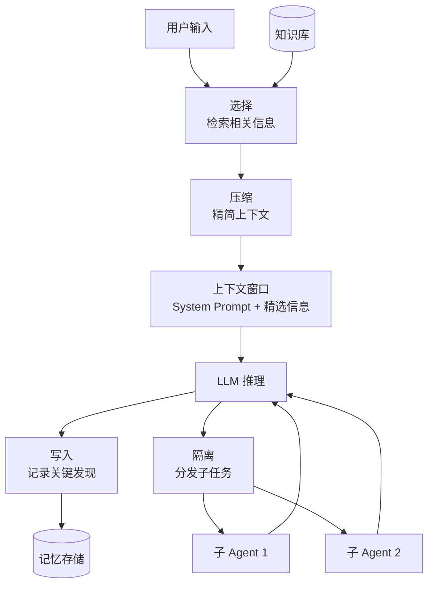

::: warning AI 含量说明
本文由 AI (Claude) 辅助生成，内容经过人工审核与编辑。部分描述可能存在简化表述，请读者结合实际使用体验参考。
:::

# 上下文工程：从 Prompt Engineering 到 Context Engineering

::: info 本文概览

- 🎯 **目标读者**: 了解 Agent 基础概念、希望提升 Agent 效果的读者
- ⏱️ **阅读时间**: 约 15 分钟
- 📚 **知识要点**: Prompt Engineering 局限、Context Engineering 定义、上下文构建四大策略、Scratchpad 实践、学术场景应用
- 📌 **前置阅读**: [LLM Agent 简介](/posts/agent-basics/2026-02-13-llm-agent-basics), [Agent 的记忆系统](/posts/agent-basics/2026-02-14-agent-memory-systems)
:::

## 一个关于“完美提示词”的挫败故事

张博士正在做一项关于”固态电池电解质”的文献综述。为了让科研 Agent 用起来效果好，他花了一下午打磨提示词。

他使用了所有已知的 Prompt Engineering 技巧：**Role-playing**（“你是一位顶尖材料科学家”）、**Few-shot**（提供了三个完美的综述范例）、**Chain-of-Thought**（“请一步步思考并分析”），甚至加上了“这对我的职业生涯至关重要”这种情绪诱导。

但当他把包含 50 篇论文摘要的文件传给 Agent 后，效果很差。Agent 遗漏了几篇最新的重要文献，还把两个完全不同的实验参数搞混了。

张博士很困惑：“我的提示词写得近乎完美，模型也是最强的，为什么它还是表现得像个笨蛋？”

原因很简单：**张博士做好了 Prompt Engineering，却忽略了 Context Engineering。** 他把所有信息一次性塞给了模型，导致模型在噪声中失去了注意力焦点。在学术研究这种信息密度高的场景中，”怎么问”只是一部分，”管理模型看到的信息”才是更重要的事。

后来，张博士改用**上下文隔离**的方式。他不再让 Agent 一次性读 50 篇，而是让一个子 Agent 专门负责筛选，把结果写入 Markdown 表格。写作 Agent 看到的就不再是 50 篇混乱的摘要，而是一份结构化的精简上下文。结果是——一份像样的文献综述不到一小时就有了初稿。

## 从 Prompt Engineering 说起

**Prompt Engineering（提示工程）** 大家都熟悉，核心是通过指令设计来提升模型的输出质量。

对于简单任务，Prompt Engineering 确实够用。但任务复杂度上来之后，它的局限性就明显了：

1. **只关注”如何问”，忽略”看什么”**：模型推理靠的不只是指令，还有输入数据。如果 Context 本身噪声太多，指令写得再好也没用。
2. **只考虑单次交互**：Prompt Engineering 针对的是单次提问，而 Agent 的多轮工作流中，上下文在动态变化，静态提示词应对不了。
3. **不可扩展**：100 篇论文不可能全部塞进一个 Prompt 里。

Spring AI Alibaba 团队有一个说法：”**LLM 的失败，20% 是模型能力不足，80% 是开发者没给对上下文。**”

这个比例不难理解。实际任务中，模型能力再强，如果给它的上下文混乱、噪声多、组织差，它也很难产出高质量结果。

Context Engineering 做的事情就是：通过检索提供准确的信息，通过过滤去掉噪声，通过结构化编排让信息易于消化。做好这些，中等性能的模型（如 GPT-4o-mini 或 Claude Haiku）在特定任务上也能超过上下文管理糟糕的顶级模型。

## 什么是上下文工程？

Prompt Engineering 关注的是”怎么写指令”，**Context Engineering（上下文工程）** 关注的是”模型能看到什么”。

前 OpenAI 科学家 Andrej Karpathy 在 2025 年 6 月给出了他的定义：
> “Context engineering is the delicate art and science of filling the context window with just the right information for the next step.”
> （上下文工程是一门精细的艺术与科学，旨在为接下来的每一步推理，在上下文窗口中填充最准确的信息。）

Anthropic 则从技术层面定义上下文：**上下文是采样（推理）时包含的所有 Token 集合。**

### 记忆是存储，上下文工程是编排

在 [上一篇文章](/posts/agent-basics/2026-02-14-agent-memory-systems) 中，我们讨论了 Agent 的记忆系统。如果说记忆系统是解决“如何存”和“存哪里”的底层架构，那么**上下文工程就是决定在特定时刻，从记忆库中提取哪些信息，并以何种形式呈现在模型面前。**

以下是两者在多个维度的对比：

| 维度 | Prompt Engineering | Context Engineering |
|------|-------------------|---------------------|
| **关注点** | 如何提问（指令设计） | 模型能看到什么（信息组织） |
| **范围** | 单次交互 | 多轮对话与完整任务链 |
| **复杂度** | 相对较低，主要靠写作 | 高，涉及检索、筛选和架构设计 |
| **核心技能** | 文本写作、Few-shot 设计 | 记忆管理、检索策略、信息编排 |
| **持久性** | 较低（随对话结束而重置） | 较高（涉及状态同步与长期存储） |
| **优化目标** | 激发模型潜在能力 | 降低噪声，提供决策关键事实 |
| **适用场景** | 简单问答、独立文本生成 | 复杂 Agent 系统、长周期科研任务 |
| **成本/效率** | 几乎无额外工程成本 | 需要开发 RAG、总结器等组件 |

::: tip 类比理解
Prompt Engineering 是给学生出一份清晰的考卷；Context Engineering 是布置整个考场——桌上放什么参考资料、墙上贴什么公式图表、手边有什么计算工具。

如果你让学生写一篇关于”量子计算”的作文，但参考书全是”古代历史”的，那考题写得再清楚也没用。上下文给错了，模型能力再强也白搭。
:::

## 上下文构建的四大策略

基于 LangChain 在 2025 年提出的框架，我们可以将上下文工程拆解为四个核心操作：**写入、选择、压缩、隔离**。

### 1. 写入（Write）——让 Agent 留下笔记

模型不会凭空记住复杂的推理过程。在学术调研中，需要让 Agent 把中间发现写下来。
- **Scratchpad（草稿纸）**：让 Agent 在回答用户前，先在一个专门的区域记录当前的进展和发现。
- **状态 Checkpoints**：在长任务中，每隔一段时间保存当前的“全局状态”，这样即便系统崩溃，Agent 也能从最近的 Checkpoint 恢复上下文，而不是从头开始。
- **持久化文件**：像我们在 Article 2 中提到的文件系统，让 Agent 把筛选出的核心论文信息写入 JSON 或 Markdown 文件，成为后续推理的可靠来源。

### 2. 选择（Select）——只给模型需要的信息

信息不是越多越好，而是越准确越好。模型的注意力资源有限。
- **语义重排（Reranking）**：在 RAG 检索中，初次检索出的 20 条信息可能有 15 条是干扰项。通过一个精简的 Reranker 模型（选择策略）只保留前 5 条真正相关的学术内容。
- **动态 Few-shot 选择**：根据用户的当前问题，从范例库中自动挑选语义最接近的例子，而不是每次都发送相同的例子。
- **工具/参数过滤**：如果你有 50 个科研工具，在当前步骤只显示最相关的 3 个，避免模型产生“选择困难”或误调用。

### 3. 压缩（Compress）——在有限窗口中装更多

当上下文快满时，必须进行精简。
- **滑动窗口与淘汰**：自动丢弃最早的、与当前任务不相关的聊天记录。
- **分层总结**：将前 10 轮的对话压缩成一段简短的历史摘要；如果任务更长，则将摘要再次压缩成“元摘要”。
- **语义去重**：学术文献中常有大量重复的背景描述，通过算法识别并合并重复的上下文，减少 Token 浪费。
- **Token 预算管理**：动态计算每个模块占用的空间，自动修剪无关紧要的元数据（如冗长的 URL 或引文格式）。

### 4. 隔离（Isolate）——给每个子任务独立空间

不要让一个 Agent 同时做所有事，上下文会互相污染。这是构建复杂流程时常见的错误。

- **任务解耦**：将综述任务拆解为“文献搜索”、“摘要阅读”、“逻辑串联”三个子任务。
- **上下文沙盒化**：每一个子任务都应该有一个独立的上下文生命周期。例如，在进行“文献搜索”时，模型看到的应该是搜索 API 的文档和原始搜索结果；而在进行“逻辑串联”时，模型看到的应该是已经精炼后的摘要列表。
- **多 Agent 独立上下文**：文献检索 Agent 只看搜索结果，数据分析 Agent 只看实验表格。每个 Agent 拥有独立的、干净的上下文，防止检索到的噪声（比如一些无关的搜索建议）干扰到最终的写作逻辑。
- **减少”长序列注意力偏置”**：隔离缩短了单次推理的上下文长度。LLM 在处理很长的上下文时容易忽略中间部分的信息（Lost in the Middle），隔离能缓解这个问题。

### 上下文流转逻辑图


```mermaid
graph TD
    Input[用户输入] --> Select[选择<br/>检索相关信息]
    Select --> Compress[压缩<br/>精简上下文]
    Knowledge[(知识库)] --> Select
    Compress --> Window[上下文窗口<br/>System Prompt + 精选信息]
    Window --> LLM[LLM 推理]
    LLM --> Write[写入<br/>记录关键发现]
    Write --> Memory[(记忆存储)]
    LLM --> Isolate[隔离<br/>分发子任务]
    Isolate --> SubAgent1[子 Agent 1]
    Isolate --> SubAgent2[子 Agent 2]
    SubAgent1 --> LLM
    SubAgent2 --> LLM
```

## Scratchpad：Agent 的“草稿纸”

在 Context Engineering 的各种实践中，**Scratchpad（草稿纸/思考垫）** 对学术科研 Agent 的效果提升最明显。

大模型处理长文本时存在”中间信息丢失”（Lost in the Middle）的现象——直接在对话中输入大量文献，模型往往只记得开头和结尾。Scratchpad 的做法是把关键信息从对话流中提取出来，固定在一个持续可见的区域。

它和简单的 Chain-of-Thought（思维链）不同，Scratchpad 是一个**动态更新的上下文状态区**。

想象一个正在进行综述调研的 Agent，它的 Scratchpad 可能长这样：

```markdown
## 当前任务
分析 Transformer 架构在小样本学习中的应用

## 已完成
- ✅ 搜索 2024-2026 年相关论文，找到 23 篇
- ✅ 筛选核心论文 8 篇，涵盖 Adapter 和 LoRA 方法

## 关键发现
1. Adapter-based methods 在极小样本场景（1-5 shot）下表现最佳。
2. 数据增强与 Transformer 的结合是当前提升鲁棒性的主流方案。
3. [需要进一步验证] 某些论文提到轻量化参数会降低跨领域迁移能力。

## 待办
- [ ] 提取 8 篇论文的实验结果对比表格
- [ ] 分析不同方法论在精度与训练时间上的差异
- [ ] 撰写初步的总结性段落
```

通过这种显式的记录，Agent 在进行下一步推理时，不需要回溯几千个 Token 前的对话，只需要扫一眼 Scratchpad，就能知道“我是谁”、“我在哪”、“我下一步要做什么”。

::: tip 笔者经验
在我自己的科研工作流中，我发现给 Agent 设置一个“工作状态文件”（Status File）比仅仅在对话中思考更有效。每当 Agent 发现一个关键结论，我都会要求它更新这个文件。

这对减少 Agent 的”幻觉”很有帮助。因为模型后续每一步都会参考这份反复验证过的”草稿”，而不是凭空猜测几轮对话前的信息。
:::

## 学术场景：构建高质量的研究上下文

作为学术研究者，具体怎么用 Context Engineering？以下是几个实践方向：

### 1. 文献综述的上下文编排（Step-by-Step）
当你需要处理 50 篇摘要时，不要一次性喂给模型：
- **Step 1 (Select)**: 利用关键词检索筛选出前 10 篇最相关的。
- **Step 2 (Write)**: 让 Agent 阅读这 10 篇，在 Scratchpad 中记录它们的方法论、数据集和关键结论。
- **Step 3 (Compress)**: 要求 Agent 将这 10 篇的内容压缩成一个 Markdown 表格。
- **Step 4 (Loop)**: 丢弃 Step 2 的原始摘要上下文，保留 Step 3 的表格。然后再读取接下来的 10 篇。
- **结果**：模型始终只持有“最新读到的 10 篇”+“之前 40 篇的结构化摘要”，上下文始终保持整洁且信息密度极高。

### 2. 实验分析的上下文组织
面对大量实验数据，核心思路是**用元数据代替原始数据**。
- 把 CSV/Excel 原始数据文件放在外部存储中。
- 在上下文中只提供数据结构的 **Schema**（字段名、数据类型）和**描述性统计特征**（均值、标准差、分位数）。
- 这样 Agent 在编写绘图代码或分析趋势时，不会被数万行原始数据干扰，逻辑更清晰。

### 3. 论文写作的上下文编排
- **模块化上下文**：为“引言”、“方法论”、“实验”分别创建独立的上下文环境。
- **参考资料精准投放**：在写“引言”时，上下文只填充 Outline 和 5 篇核心综述的摘要；在写“实验”时，上下文则替换为实验方案和具体结果。
- **风格一致性**：将你的 Style Guide（写作风格指南）和两篇你最喜欢的范文作为 Few-shot 示例，固定在 System Prompt 中，确保全文语气统一。

## 给学术研究者的 Context Engineering 检查清单

启动科研 Agent 任务前，花 5 分钟对照以下清单检查一遍：

1. **[ ] 噪声最小化**：我传给模型的数据里，是否包含大量无关的 HTML 标签、多余的引文格式或广告信息？（如果有，请先清洗数据）。
2. **[ ] 关键状态固定**：Agent 当前的任务目标、已完成的进展是否在一个持续可见的 Scratchpad 或 System Prompt 中？
3. **[ ] 任务隔离**：我是否在试图让模型在一个对话上下文里完成“搜索+阅读+分析+写作”所有事？（如果是，请尝试拆分为多个对话或多个子 Agent）。
4. **[ ] 检索质量**：如果使用 RAG，检索出的内容真的能回答我的问题吗？我是否需要增加一个 Rerank 步骤来二次筛选上下文？
5. **[ ] 术语一致性**：上下文中的术语定义是否统一？（A 处叫 X，B 处叫 Y，会增加模型的推理成本）。

::: details 📖 选读内容（点击展开）
**## 学术视角：Context Engineering 的研究进展** {#academic-research}

- **综述性研究**：Mei 等人在 2025 年 7 月发布的《A Survey of Context Engineering for Large Language Models》（arXiv:2507.13334）调研了超过 1400 篇相关论文。该文指出，随着模型长文本能力的提升，如何防止“检索噪声污染”已成为当前最重要的研究课题。
- **ACE 框架**：斯坦福大学提出的 **ACE (Agentic Context Engineering)** 框架（ICLR 2026, arXiv:2510.04618）通过让模型自主决定何时更新、何时修剪上下文，在多项 Agent 基准测试中实现了 10.6% 的性能提升。
- **CoALA 架构**：Sumers 等人在 2023 年提出的 **Cognitive Architectures for Language Agents** 也强调了将 LLM 视为“处理器”，而将上下文和存储视为“寄存器”和“内存”的架构思想。
- **趋势**：学术界逐渐认为上下文工程不只是开发技巧，而是认知架构（Cognitive Architectures）的组成部分。未来的科研 Agent 需要具备复杂的上下文调度能力。
:::

## 总结

1. **从”写好提示词”到”管好上下文”**：Context Engineering 是 Prompt Engineering 的自然延伸。关注点从”怎么问”扩展到”模型在推理时能看到什么”。
2. **写入、选择、压缩、隔离**：这四个策略解决的是”有限窗口 vs 无限信息”的矛盾，实际使用中需要根据任务情况灵活组合。
3. **多数 Agent 失败源于上下文问题**：在学术场景中，优化上下文往往比换更贵的模型更有效。管理好上下文的中等模型，实际表现经常优于上下文混乱的顶级模型。

如果你的科研 Agent 表现不好，先别急着换模型。试试清理冗余信息，给它一张”草稿纸”，让它在干净的上下文里思考。

## 参考资料

- [Anthropic: Building Effective Agents (2024)](https://www.anthropic.com/research/building-effective-agents)
- [A Survey of Context Engineering for Large Language Models (Mei et al., 2025)](https://arxiv.org/abs/2507.13334)
- [Agentic Context Engineering (ACE) (ICLR 2026)](https://arxiv.org/abs/2510.04618)
- [Cognitive Architectures for Language Agents (CoALA) (Sumers et al., 2023)](https://arxiv.org/abs/2309.02427)
- [The "Lost in the Middle" Phenomenon in LLMs (Liu et al., 2023)](https://arxiv.org/abs/2307.03172)
