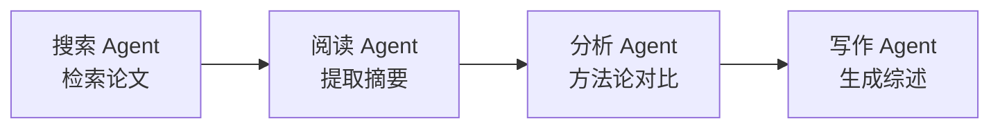
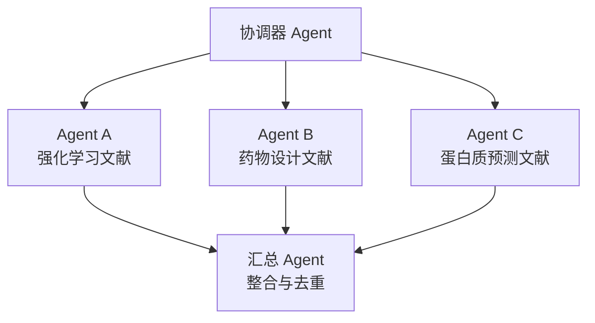
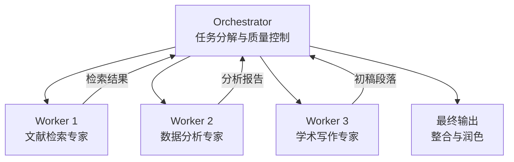
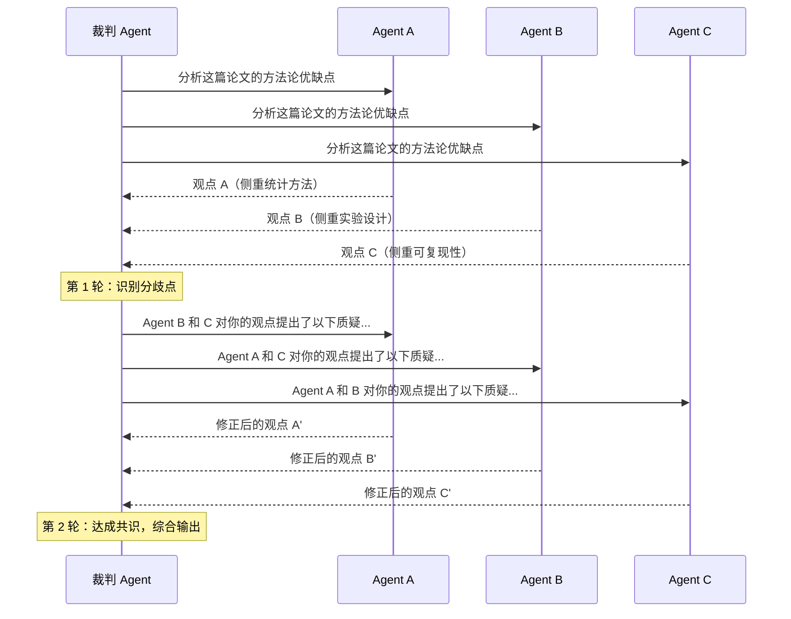

::: warning AI 含量说明
本文由 AI (Claude) 辅助生成，内容经过人工审核与编辑。部分描述可能存在简化表述，请读者结合实际使用体验参考。
:::

# 多 Agent 协作

::: info 本文概览

- 🎯 **目标读者**: 了解 Agent 基础概念、希望构建复杂科研工作流的研究者
- ⏱️ **阅读时间**: 约 18 分钟
- 📚 **知识要点**: 单 Agent 局限、四种协作模式、主流框架对比、学术场景实战、协作中的挑战与最佳实践
- 📌 **前置阅读**: [LLM Agent 简介](/posts/agent-basics/2026-02-13-llm-agent-basics) , [Agent 的记忆系统](/posts/agent-basics/2026-02-14-agent-memory-systems), [上下文工程](/posts/agent-basics/2026-02-15-context-engineering)
  :::

## 一个人做综述的崩溃时刻

王同学正在为他的博士开题报告准备一份跨学科的文献综述，主题横跨"强化学习"、"药物分子设计"和"蛋白质结构预测"三个领域。

他给自己最强的 Agent 布置了这个任务。Agent 开始了漫长的工作：先搜索论文，然后阅读摘要，接着分析方法论，再进行跨领域对比，最后撰写综述。然而 3 个小时后，Agent 交出的结果让他大失所望：

- 强化学习部分写得还不错，但 **药物分子设计的术语大量出错**——它把 "SMILES 分子表示" 和 "Smile 情感分析" 混为一谈了
- 蛋白质结构预测部分几乎**照搬了 AlphaFold 的维基百科介绍**，毫无深度
- 更要命的是，跨领域对比那一段完全是**幻觉**——它编造了一篇根本不存在的论文来支撑论点

问题出在哪里？**不是 Agent 不够聪明，而是我们让一个人干了整个实验室的活。**

这就像让一位优秀的化学家同时兼任机器学习工程师、生物信息学家和学术写作专家。即使是人类中的天才，也很难在三个领域同时保持专业水准。

解决方案是什么？**组建一个 AI 科研团队**——让不同的 Agent 各司其职，协同完成复杂任务。

## 为什么需要多 Agent？

在 [第一篇文章](/posts/agent-basics/2026-02-13-llm-agent-basics) 中，我们了解了单个 Agent 的核心能力：感知、推理、行动。但单个 Agent 存在三个根本性的局限：

| 局限             | 表现                                   | 根因                                            |
| ---------------- | -------------------------------------- | ----------------------------------------------- |
| **上下文瓶颈**   | 任务越复杂，上下文越混乱，性能急剧下降 | 有限的上下文窗口无法同时承载多领域知识          |
| **专业性天花板** | 通用 Agent 在专业任务上表现平庸        | System Prompt 无法让一个 Agent 同时精通多个领域 |
| **可靠性衰减**   | 长任务链中错误不断累积                 | 单点故障无法自我检测和纠正                      |

::: tip 类比理解
单 Agent 就像一个"全栈科研实习生"——什么都能做一点，但在任何一个方向上都达不到专家水平。而多 Agent 协作就像组建一个正式的课题组：有人负责文献检索，有人负责数据分析，有人负责论文撰写，导师负责统筹协调。每个人只需要在自己的领域做到最好。
:::

## 四种协作模式

多 Agent 协作并不是简单地"多开几个 Agent"。不同的任务结构需要不同的协作模式。以下是四种最常见的模式：

### 1. 顺序模式（Pipeline）

最简单的协作方式：Agent A 的输出直接作为 Agent B 的输入，像流水线一样依次执行。



**适用场景**：文献综述流水线、数据处理管道（采集→清洗→分析→可视化）

**优点**：逻辑清晰、容易调试、每个 Agent 的上下文保持干净

**缺点**：速度慢（串行执行）、错误会逐级传递

### 2. 并行模式（Parallel）

将一个大任务拆分为多个互不依赖的子任务，由不同 Agent 同时处理，最后汇总结果。



**适用场景**：跨领域文献调研、多数据源同步采集、批量实验分析

**优点**：速度快（并行执行）、各 Agent 上下文互不污染

**缺点**：需要一个汇总阶段来整合结果、子任务间难以共享中间发现

### 3. 层级模式（Hierarchical）

引入"管理者 Agent"来分配任务、监控进度和评估质量。这是 Anthropic 在《Building Effective Agents》中重点推荐的 **Orchestrator-Workers** 架构。



**适用场景**：复杂科研项目管理、需要动态调整策略的长任务

**优点**：灵活性高（Orchestrator 可根据中间结果动态调整策略）、质量可控

**缺点**：Orchestrator 本身成为性能瓶颈、架构复杂度高

### 4. 辩论模式（Debate）

让多个 Agent 对同一个问题分别给出独立的答案，然后通过多轮辩论来收敛到最优解。Du et al. (2023) 在 ICML 2024 上发表的研究表明，多 Agent 辩论能显著提升事实准确性和推理能力——在 GSM8K 等基准测试上，3-5 个 Agent 的辩论效果明显优于单 Agent 自我反思。



**适用场景**：论文审稿、假设验证、需要高可靠性判断的场景

**优点**：显著降低幻觉率、从多角度审视问题、适合需要严谨推理的学术场景

**缺点**：成本高（多个 Agent × 多轮对话）、收敛速度不确定

### 模式选择指南

| 场景                | 推荐模式    | 理由                                      |
| ------------------- | ----------- | ----------------------------------------- |
| 文献综述流水线      | 顺序 + 并行 | 各领域并行检索，结果顺序整合              |
| 实验数据分析        | 层级        | Orchestrator 根据数据特点动态分配分析策略 |
| 论文审稿 / 假设验证 | 辩论        | 多角度审视，降低偏见和幻觉                |
| 跨领域文献调研      | 并行        | 各领域独立检索，互不干扰                  |
| 论文写作            | 层级 + 顺序 | 导师分配章节，各 Agent 按序完成           |

## 主流框架概览

了解了协作模式后，我们来看看当前主流的多 Agent 框架。对于学术研究者来说，选择框架的关键在于：**是否容易上手、是否支持你需要的协作模式、以及社区活跃度**。

| 维度           | AutoGen (Microsoft)  | CrewAI         | OpenAI Agents SDK |
| -------------- | -------------------- | -------------- | ----------------- |
| **核心理念**   | 多 Agent 对话框架    | 角色扮演协作   | 轻量原语式设计    |
| **协作模式**   | 对话驱动，灵活度高   | 顺序 / 层级    | Handoff 机制      |
| **上手难度**   | 中等                 | 低             | 低                |
| **适合场景**   | 研究原型、复杂对话流 | 快速搭建工作流 | 生产级应用        |
| **社区活跃度** | ⭐⭐⭐⭐⭐           | ⭐⭐⭐⭐       | ⭐⭐⭐⭐          |
| **学术友好度** | 高（微软研究院出品） | 中             | 中                |

### AutoGen：对话驱动的多 Agent 框架

微软研究院推出的 AutoGen 是学术界最流行的多 Agent 框架之一。它的核心思想是：**Agent 之间通过对话来协作**，就像一场有组织的学术研讨会。

AutoGen 的 `GroupChat` 机制允许多个 Agent 在一个共享的聊天室中讨论问题，由一个 `GroupChatManager` 来决定下一个发言的 Agent。这种设计天然适合学术场景中的讨论式任务——比如让一个"方法论专家 Agent"和"统计学专家 Agent"就实验设计方案展开对话。

### CrewAI：角色驱动的快速搭建

CrewAI 的设计哲学是让非技术用户也能快速搭建多 Agent 工作流。它采用三层抽象：

- **Agent**：定义角色（如"资深文献检索专家"）和目标
- **Task**：定义具体任务和预期输出
- **Crew**：将 Agent 和 Task 组合成一个协作团队

这种角色扮演（Role-Playing）的方式降低了门槛，但在复杂场景下灵活性不如 AutoGen。

### OpenAI Agents SDK：Handoff 与 Guardrails

OpenAI 在 2025 年推出的 Agents SDK 提供了一套轻量但强大的原语。其中最核心的两个概念：

- **Handoff（移交）**：Agent 可以将对话"移交"给另一个更专业的 Agent，类似于医院的转诊机制
- **Guardrails（护栏）**：在 Agent 执行过程中进行实时验证，防止偏离预期

::: tip 笔者建议
对于学术研究者，我的建议是：

- **如果你是做 Agent 相关研究**，选 AutoGen——它的论文引用率最高，学术社区最活跃
- **如果你想快速搭建科研工作流**，选 CrewAI——上手最快，概念最直观
- **如果你在做生产级应用**，关注 OpenAI Agents SDK——Handoff 机制设计优雅，Guardrails 提供了可靠性保障

当然，你也完全可以不用任何框架。Anthropic 在《Building Effective Agents》中明确指出："**大多数应用不需要复杂的框架，直接用代码编排 LLM 调用往往更高效。**" 框架的价值在于标准化和复用，但如果你的需求简单明确，直接写代码可能是更好的选择。
:::

## Anthropic 的子 Agent 架构

在主流框架之外，Anthropic 提出了一套更偏向工程实践的多 Agent 设计模式，非常值得学术研究者参考。

### Orchestrator-Workers：最实用的学术科研模式

Anthropic 将层级协作模式具象化为 **Orchestrator-Workers** 架构：

1. **Orchestrator（编排器）** 接收用户的高层目标，将其分解为子任务
2. **Workers（执行器）** 各自独立完成子任务，拥有专属的 System Prompt 和工具集
3. Orchestrator 收集 Worker 的输出，进行整合、质量评估和迭代

这种架构的关键在于：**每个 Worker 只看到自己需要的上下文**（这正是我们在[上下文工程](/posts/agent-basics/2026-02-15-context-engineering)中讨论的"隔离"策略）。

### Evaluator-Optimizer：自动迭代优化

另一种强大的模式是 **Evaluator-Optimizer**：一个 Agent 负责生成（Generator），另一个 Agent 负责评估（Evaluator），两者交替执行直到输出满足质量标准。

在学术写作中，这意味着：

- **Generator Agent** 写出论文初稿的某个段落
- **Evaluator Agent** 以审稿人的视角提出修改意见（逻辑漏洞、引用缺失、表述模糊）
- Generator 根据反馈修订，Evaluator 再次评估
- 循环直到 Evaluator 给出"通过"

这种自我迭代的闭环在学术场景中特别有价值——它模拟了现实中"写作→审稿→修订"的流程。

## 学术场景实战

### 场景 1：跨领域文献综述流水线

**目标**：完成一篇涉及 3 个领域的文献综述

**架构**：并行 + 顺序 + 层级

```
Orchestrator（导师角色）
├── 并行阶段
│   ├── 领域 A 检索 Agent（带 Semantic Scholar API 工具）
│   ├── 领域 B 检索 Agent（带 PubMed API 工具）
│   └── 领域 C 检索 Agent（带 arXiv API 工具）
├── 顺序阶段
│   ├── 去重 & 筛选 Agent（合并结果，按相关性排序）
│   ├── 深度阅读 Agent（提取方法论、数据集、关键结论）
│   └── 写作 Agent（生成综述段落）
└── 评估阶段
    └── 审稿 Agent（检查引用准确性、逻辑连贯性）
```

**关键设计点**：

- 每个检索 Agent 只搜索自己领域的数据库，避免跨领域术语混淆
- 去重 Agent 使用 DOI 去重，避免同一篇论文被多次引用
- 审稿 Agent 独立于写作 Agent，提供无偏见的质量评估

::: details 📖 选读内容：AI Scientist v2 —— 多 Agent 科研系统的前沿案例

Sakana AI 在 2025 年发布的 **AI Scientist v2** 是目前最完整的多 Agent 科研系统之一。它采用层级 + 辩论的混合架构，实现了从"提出假设→设计实验→执行代码→撰写论文→自我审稿"的全流程自动化。

关键数据：

- 单次完整科研流程的成本约 **$25-30**（包含所有 API 调用和计算资源）
- AI Scientist 撰写的论文已被 **ICLR 2025 Workshop** 接收——这是首篇由 AI 系统独立完成并被顶会收录的学术论文
- 系统使用了 Evaluator-Optimizer 模式：一个 Agent 写论文，另一个以 NeurIPS 审稿标准进行评审

这个案例完美展示了多 Agent 协作在学术场景中的潜力：**不是替代研究者，而是将重复性的科研工作流程自动化。**

参考：[The AI Scientist v2 (Sakana AI, 2025)](https://arxiv.org/abs/2504.08066)
:::

### 场景 2：假设生成与验证

**目标**：基于实验数据生成研究假设并评估其可行性

**架构**：辩论模式

1. **数据分析 Agent** 从实验数据中发现异常模式和统计显著性
2. **假设生成 Agent** 基于数据模式提出 3-5 个候选假设
3. **文献验证 Agent** 检索已有研究来验证或反驳每个假设
4. **辩论轮**：三个 Agent 就每个假设的合理性进行交叉质询
5. **汇总 Agent** 输出最终的假设排序和可行性报告

### 场景 3：多角度论文审稿

**目标**：模拟多位审稿人，对论文草稿进行全面评审

**架构**：并行 + 辩论

- **Reviewer A**（方法论专家）：聚焦实验设计的合理性
- **Reviewer B**（统计专家）：审查数据分析的严谨性
- **Reviewer C**（领域专家）：评估与该领域已有工作的关联和创新性
- **Meta-Reviewer**：综合三位审稿人意见，给出最终评审报告

::: tip 笔者经验
我在实际科研中经常使用一种简化版的"多角度审稿"：让同一个强力模型扮演不同的审稿人角色，但关键是**为每个角色创建独立的对话上下文**。比如方法论审稿人只看到方法论章节和相关参考文献，统计审稿人只看到实验数据和分析过程。这种上下文隔离比让一个 Agent 一次性读完全文再分角色评审，效果要好得多。
:::

## 协作中的挑战与最佳实践

多 Agent 协作并非万能药。最近的研究进一步量化了这一点：NeurIPS 2025 上发表的 MAST 分类法（Cemri et al.）系统分析了 1600+ 条多 Agent 交互记录，识别出 **14 种失败模式**，分为四大类：任务规划失败、Agent 间通信失败、工具使用失败和推理执行失败。

以下是实践中最常见的五个问题及应对策略：

### 1. 信息传递损失

当 Agent A 的输出传给 Agent B 时，关键信息可能被丢失或曲解。这就像"传话游戏"——经过几轮传递后，原始信息可能面目全非。

**应对策略**：使用结构化的中间格式（JSON、Markdown 表格）而非自然语言来传递信息。结构化格式比自由文本的信息保真度高得多。

### 2. 级联错误

如果 Agent A 犯了一个错误（比如引用了一篇不存在的论文），后续所有 Agent 都会基于这个错误继续工作，导致最终结果完全不可用。

**应对策略**：在关键节点设置 **验证 Agent**（Guardrails），对中间输出进行事实核查。特别是在学术场景中，每个 DOI、每个数据点都应该有验证环节。

### 3. 成本控制

多 Agent 系统的 API 调用成本可以快速失控。假设一个 4-Agent 的辩论系统进行 3 轮辩论，每轮每个 Agent 消耗 5000 Token，仅辩论部分就需要 60000 Token。

**应对策略**：

- 为每个 Agent 设置 Token 预算上限
- 对非关键任务使用更便宜的模型（如 GPT-4o-mini、Claude Haiku）
- 只在需要高可靠性的环节（如事实验证）使用顶级模型

### 4. 调试困难

当最终结果出错时，定位问题来源变得极其困难——你需要逐一回溯每个 Agent 的输入输出。

**应对策略**：为每个 Agent 的输入和输出建立日志系统。在开发阶段，打印每个 Agent 的完整上下文和推理过程。

### 5. 过度工程化

不是所有任务都需要多 Agent。如果一个简单的顺序调用就能完成的任务，用 5 个 Agent 来做反而会引入不必要的复杂度和故障点。

**应对策略**：**先用单 Agent 尝试，只有当单 Agent 明确无法满足需求时，再考虑多 Agent 架构。** 这是 Anthropic 的核心建议。

## 总结

1. **单 Agent 有天花板，多 Agent 是自然的进化**。当任务涉及多领域知识、需要多角度审视、或单个上下文窗口无法承载时，多 Agent 协作是解决方案。但要记住：多 Agent 不是炫技工具，而是解决真实问题的架构选择。
2. **选择正确的协作模式比选择框架更重要**。顺序、并行、层级、辩论——这四种模式可以灵活组合。在学术场景中，"并行检索 + 顺序整合 + 辩论验证"是一种经过验证的高效组合。
3. **上下文隔离是多 Agent 成功的关键**。每个 Agent 只应看到它需要的信息。这与我们在 [上下文工程](/posts/agent-basics/2026-02-15-context-engineering) 中讨论的"隔离"策略一脉相承——在多 Agent 系统中，这个原则变得更加重要。

## 参考资料

- [Anthropic: Building Effective Agents (2024)](https://www.anthropic.com/research/building-effective-agents)
- [AutoGen: Enabling Next-Gen LLM Applications via Multi-Agent Conversation (Wu et al., 2023)](https://arxiv.org/abs/2308.08155)
- [Improving Factuality and Reasoning in Language Models through Multiagent Debate (Du et al., 2024, ICML)](https://arxiv.org/abs/2305.14325)
- [A Survey on Large Language Model based Autonomous Agents (Wang et al., 2023)](https://arxiv.org/abs/2308.11432)
- [Cognitive Architectures for Language Agents (CoALA) (Sumers et al., 2023)](https://arxiv.org/abs/2309.02427)
- [Why Do Multi-Agent LLM Systems Fail? — MAST Failure Taxonomy (Cemri et al., 2025, NeurIPS)](https://arxiv.org/abs/2503.13657)
- [The AI Scientist v2 (Sakana AI, 2025)](https://arxiv.org/abs/2504.08066)
