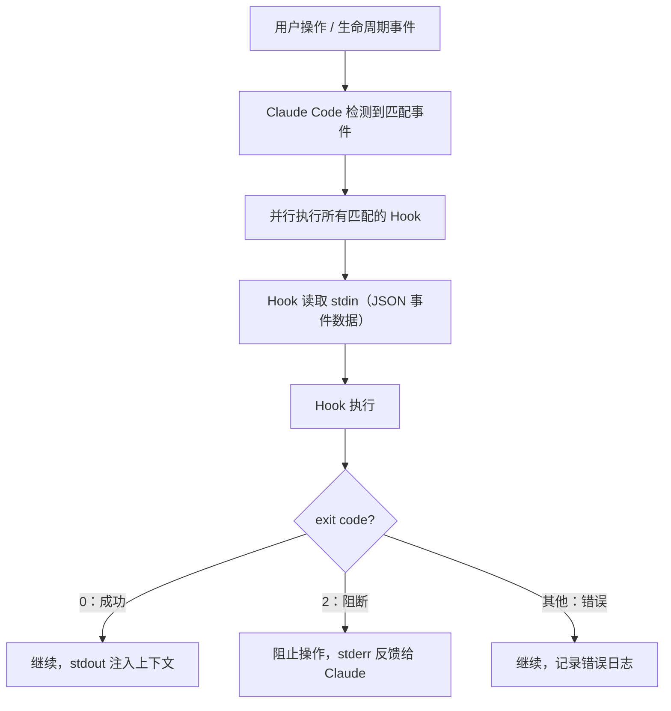
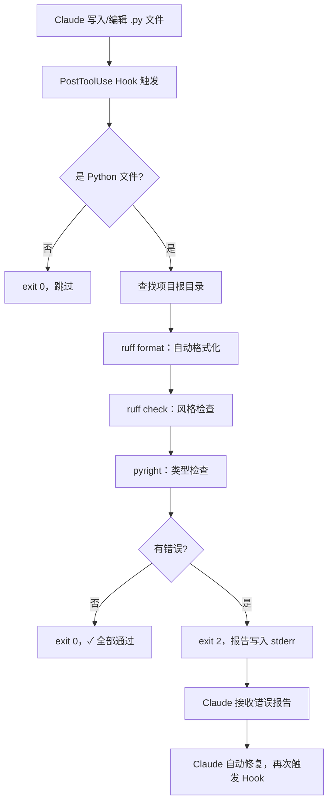

::: warning AI 含量说明
本文由 AI (Claude) 辅助生成，内容经过人工审核与编辑。部分描述可能存在简化表述，请读者结合实际使用体验参考。
:::

# Claude Code Hooks：用确定性保证自动化工作流

::: info 本文概览

- 🎯 **目标读者**：希望在 Claude Code 工作流中加入自动化保障机制的用户
- ⏱️ **阅读时间**：约 16 分钟
- 📚 **知识要点**：Hooks 工作原理、事件类型、配置语法、项目实例、实用场景
:::

## 提示词是建议，Hook 是保证

在使用 Claude Code 一段时间后，你可能遇到过这样的情况：

- 告诉 Claude "每次修改文件后记得运行 prettier"，但 Claude 有时会忘记
- 在 CLAUDE.md 里写了"禁止修改 `.env` 文件"，但某次它还是碰了
- 希望任务完成后收到桌面通知，但必须时刻盯着屏幕

这些问题的根源在于：**CLAUDE.md 里的规则是建议，不是保证**。LLM 的行为本质上是概率性的，无论写得多详细，都可能被遗漏或忽略。

**Hooks** 解决的就是这个问题。Hook 是 Claude Code 生命周期中挂载的 shell 命令——不经过 LLM 判断，在指定时机直接执行，每次都会运行。用官方的话说：

> *Prompts are great for suggestions; hooks are guarantees.*（提示词给建议，Hook 给保证。）

---

## Hooks 的工作原理

### 基本架构



### Hook 接收什么？

每次触发时，Claude Code 通过 **stdin** 向 Hook 脚本传入 JSON 格式的事件数据：

```json
{
  "session_id": "abc123",
  "cwd": "/Users/user/myproject",
  "hook_event_name": "PreToolUse",
  "tool_name": "Edit",
  "tool_input": {
    "file_path": "src/main.py",
    "old_string": "...",
    "new_string": "..."
  }
}
```

不同事件额外携带不同字段：
- `UserPromptSubmit`：包含 `prompt`（用户输入的文字）
- `PostToolUse`：同时包含 `tool_input`（调用参数）和 `tool_response`（执行结果）
- `SessionStart`：包含 `source`（`startup` / `resume` / `compact`）

### Hook 能做什么？

| 控制方式 | Exit Code | 效果 |
|---------|-----------|------|
| **允许继续** | `0` | 操作正常执行；stdout 内容注入 Claude 上下文（UserPromptSubmit、SessionStart 事件） |
| **阻断操作** | `2` | 操作被阻止；stderr 内容作为反馈发给 Claude |
| **记录错误** | 其他 | 操作继续，stderr 记录到日志 |

对于 `PreToolUse` 事件，Hook 还可以输出 JSON 来精细控制：

```json
{
  "hookSpecificOutput": {
    "hookEventName": "PreToolUse",
    "permissionDecision": "deny",
    "permissionDecisionReason": "请使用 rg 替代 grep 以获得更好性能",
    "updatedInput": {"command": "rg -l pattern ."}
  }
}
```

`permissionDecision` 可选值：`allow`、`deny`、`ask`（让用户手动确认）。

---

## 主要事件类型

Claude Code 支持 18 个 Hook 事件，以下是最常用的几个：

| 事件 | 触发时机 | 是否可阻断 | 常见用途 |
|------|----------|-----------|---------|
| `UserPromptSubmit` | 用户提交 prompt 前 | 是 | 注入上下文、强制流程检查 |
| `PreToolUse` | 工具调用执行前 | 是 | 安全检查、权限验证、命令替换 |
| `PostToolUse` | 工具调用成功后 | 否（已执行） | 自动格式化、测试触发、日志记录 |
| `Stop` | Claude 完成响应时 | exit 2 = 强制继续 | 任务完成验证、通知 |
| `Notification` | Claude 发出通知时 | 否 | 桌面通知、消息推送 |
| `SessionStart` | session 开始/恢复时 | 否 | 重新注入上下文、环境检查 |
| `SubagentStop` | 子代理结束时 | 是 | 子任务质量验证 |
| `PreCompact` | 上下文压缩前 | 否 | 保存关键信息 |

**Matcher（匹配器）**：`PreToolUse` 和 `PostToolUse` 支持通过 matcher 筛选特定工具：

```json
"matcher": "Edit|Write"           // 匹配 Edit 或 Write 工具
"matcher": "Bash"                 // 只匹配 Bash 工具
"matcher": "mcp__github__.*"     // 匹配 GitHub MCP 的所有工具（正则前缀）
"matcher": ""                     // 匹配所有工具（省略或空字符串）
```

---

## 配置方式

Hook 在 `settings.json` 中配置。Claude Code 支持多层配置，优先级从高到低：

```
企业托管策略（最高）
  ↓
.claude/settings.json（项目级，可提交 git，团队共享）
  ↓
.claude/settings.local.json（本地级，自动 gitignore，个人配置）
  ↓
~/.claude/settings.json（用户全局级，最低）
```

基本结构：

```json
{
  "hooks": {
    "PostToolUse": [
      {
        "matcher": "Edit|Write",
        "hooks": [
          {
            "type": "command",
            "command": "jq -r '.tool_input.file_path' | xargs npx prettier --write",
            "timeout": 30
          }
        ]
      }
    ]
  }
}
```

Hook 有三种类型：

| 类型 | 说明 | 示例 |
|------|------|------|
| `command` | 执行 shell 命令（最常用） | `"command": "bash .claude/hooks/check.sh"` |
| `prompt` | 用 LLM 评估（默认走 Haiku，轻量快速） | `"prompt": "检查任务是否全部完成..."` |

---

## 项目实例：skill-eval-local.sh 深度解析

本博客项目在 `.claude/settings.local.json` 中配置了一个 `UserPromptSubmit` Hook：

```json
{
  "hooks": {
    "UserPromptSubmit": [
      {
        "hooks": [
          {
            "type": "command",
            "command": ".claude/hooks/skill-eval-local.sh",
            "statusMessage": "正在评估可用技能..."
          }
        ]
      }
    ]
  }
}
```

### 脚本内容

`.claude/hooks/skill-eval-local.sh`：

```bash
#!/usr/bin/env bash

# UserPromptSubmit Hook - 项目技能强制评估流程
# 在用户每次提交任务前，自动列出可用技能并要求 AI 评估

set -euo pipefail

user_input="${1:-}"

# 如果是 slash 命令（以 / 开头），直接退出不处理
if [[ "$user_input" == /* ]]; then
  exit 0
fi

# 获取技能列表（通过 openskills 工具）
if command -v npx &> /dev/null; then
  skills_output=$(npx openskills list 2>/dev/null || echo "")
else
  skills_output=""
fi

# 如果没有技能列表，直接退出
if [ -z "$skills_output" ]; then
  exit 0
fi

# 向 Claude 上下文注入强制评估指令
cat <<'EOF'
## 指令：强制技能激活流程（必须执行）

在开始任务实现之前，你必须完成以下三步流程：

### 步骤 1 - 技能评估
针对以下每个可用技能，逐一评估当前用户任务是否需要该技能。
评估格式：`[技能名] - 是/否 - [理由]`

可用技能列表：
EOF

echo "$skills_output"

cat <<'EOF'

### 步骤 2 - 技能激活
- **如果任何技能评估为"是"**：立即使用 `Skill()` 工具激活对应技能
- **如果所有技能都是"否"**：明确说明，然后继续

### 步骤 3 - 任务实现
只有在完成步骤 1 和步骤 2 后，才能开始实际的任务实现。
EOF
```

### 逐行解析

**第 8 行**：读取用户输入（`UserPromptSubmit` 事件通过第一个参数传入用户的 prompt 文本）

**第 10-12 行**：跳过 slash 命令——用户输入 `/clear`、`/help` 等时直接退出，不触发技能评估

**第 15-19 行**：调用 `npx openskills list` 动态获取项目中所有已注册 Skill 的清单，包括名称和描述

**第 27-61 行**：向 **stdout** 输出结构化的中文指令。`UserPromptSubmit` Hook 的 stdout 内容会被自动注入 Claude 的上下文，相当于在用户 prompt 前追加了一段系统级指令

整体效果：每次用户提交任务时（非 slash 命令），Claude 必须先评估所有可用 Skill，再决定是否激活，最后才开始执行任务。这个流程不依赖 AI 记忆，每次都会执行。

下图是该 Hook 在本项目实际运行的截图：Claude 按三步流程逐一评估 25 个可用 Skill，判断是否激活 `content-research-writer` 和 `beautiful-prose`：


::: tip 为什么选择 Hook 而不是 CLAUDE.md？
把「强制评估 Skills」写在 CLAUDE.md 里，Claude 可能在繁忙的任务中跳过这一步。用 Hook 挂载在 `UserPromptSubmit` 上，每次提交都会触发，不依赖 Claude 主动记忆。
:::

---

## 实战案例：深度学习项目的代码质量 Hook

下面这个 Hook 来自一个深度学习项目，是一个比 Prettier 复杂的 `PostToolUse` 场景——每次 Claude 修改 Python 文件后，自动跑格式化、风格检查和类型检查，发现问题直接阻断并把报告回传给 Claude，让它自行修复。

### 配置入口

```json
{
  "hooks": {
    "PostToolUse": [
      {
        "matcher": "Write|Edit",
        "hooks": [
          {
            "type": "command",
            "command": "bash .claude/hooks/run_ruff.sh"
          }
        ]
      }
    ]
  }
}
```

### Hook 脚本（.claude/hooks/run_ruff.sh）

```bash
#!/bin/bash
# PostToolUse hook：Python 代码格式化与质量检查

INPUT_JSON=$(cat)

# 从 stdin JSON 中提取目标文件路径
TARGET_FILE=$(echo "$INPUT_JSON" | python3 -c "
import sys, json
try:
    data = json.load(sys.stdin)
    tool_input = data.get('tool_input', {})
    print(tool_input.get('file_path') or tool_input.get('path') or '')
except:
    pass
" 2>/dev/null)

# 非 Python 文件直接跳过
if [[ ! "$TARGET_FILE" =~ \.py$ ]]; then
    exit 0
fi

# 检查 uv 是否可用
if ! command -v uv &> /dev/null; then
    echo "[Hook] uv not found, skipping"
    exit 0
fi

# 向上查找项目根目录（包含 .git / pyproject.toml / ruff.toml 等标志文件）
find_project_root() {
    local dir=$(dirname "$(realpath "$1")")
    while [[ "$dir" != "/" ]]; do
        for marker in .git pyproject.toml setup.py ruff.toml .ruff.toml; do
            if [[ -e "$dir/$marker" ]]; then
                echo "$dir"
                return
            fi
        done
        dir=$(dirname "$dir")
    done
    dirname "$(realpath "$1")"
}

PROJECT_ROOT=$(find_project_root "$TARGET_FILE")
echo "[Hook] Project: $PROJECT_ROOT"
echo "[Hook] Triggered by: $(basename "$TARGET_FILE")"

# Step 1：格式化
echo "[Hook] Running ruff format..."
FORMAT_OUTPUT=$(uv tool run ruff format "$PROJECT_ROOT" 2>&1)
echo "[Hook] Format: $FORMAT_OUTPUT"

# Step 2：风格检查
echo "[Hook] Running ruff check..."
RUFF_OUTPUT=$(uv tool run ruff check --output-format=pylint "$PROJECT_ROOT" 2>&1)
RUFF_EXIT=$?

# Step 3：类型检查（pyright），过滤掉 _ 开头未使用变量的误报
echo "[Hook] Running pyright..."
PYRIGHT_JSON=$(uv tool run pyright --outputjson "$PROJECT_ROOT" 2>&1)
PYRIGHT_EXIT=$?

PYRIGHT_OUTPUT=$(echo "$PYRIGHT_JSON" | python3 -c "
import sys, json
try:
    data = json.load(sys.stdin)
    for d in data.get('generalDiagnostics', []):
        sev = d.get('severity', '')
        if sev not in ('error', 'warning'):
            continue
        msg = d.get('message', '')
        # 忽略 _ 前缀的未使用变量（这是惯例，不是错误）
        if 'is not accessed' in msg and msg.startswith('\"_'):
            continue
        f = d.get('file', '')
        line = d.get('range', {}).get('start', {}).get('line', 0) + 1
        rule = d.get('rule', '')
        rule_str = f' [{rule}]' if rule else ''
        print(f'{f}:{line}: {sev}{rule_str}: {msg}')
except:
    pass
" 2>/dev/null)

# 汇总结果：有任何问题则以 exit 2 阻断，将完整报告写入 stderr 回传给 Claude
HAS_ERRORS=0
[[ $RUFF_EXIT -ne 0 && -n "$RUFF_OUTPUT" ]] && HAS_ERRORS=1
[[ -n "$PYRIGHT_OUTPUT" ]] && HAS_ERRORS=1

if [[ $HAS_ERRORS -eq 1 ]]; then
    {
        echo "[Hook] ❌ Issues detected:"
        echo "--------------------------------------------------"
        if [[ -n "$RUFF_OUTPUT" ]]; then
            echo "=== Ruff ==="
            echo "$RUFF_OUTPUT"
            echo ""
        fi
        if [[ -n "$PYRIGHT_OUTPUT" ]]; then
            echo "=== Pyright ==="
            echo "$PYRIGHT_OUTPUT"
            echo ""
        fi
        echo "--------------------------------------------------"
    } >&2
    exit 2  # 阻断操作，stderr 内容发给 Claude
fi

echo "[Hook] ✓ All checks passed"
exit 0
```

### 工作流程解析



### 设计亮点

**自动定位项目根目录**：脚本向上递归查找 `.git`、`pyproject.toml`、`ruff.toml` 等标志文件，以项目整体而非单个文件为单位做检查，避免路径问题导致配置文件读取失败。

**格式化 + 检查串联**：格式化（`ruff format`）→ 风格检查（`ruff check`）→ 类型检查（`pyright`），分别覆盖不同层次的代码质量问题。

**误报过滤**：Pyright 对 `_` 开头变量的"未使用"警告是预期行为（Python 约定的忽略变量命名），脚本主动过滤，避免 Claude 在无意义的警告上浪费轮次。

**闭环修复**：`exit 2` 将错误报告回传给 Claude，Claude 读到错误后自动尝试修复，修复完再次触发 Hook，直到所有检查通过。

::: info 前置依赖
脚本依赖 [`uv`](https://docs.astral.sh/uv/)（Python 包管理器）、`ruff` 和 `pyright`。安装：
```bash
curl -LsSf https://astral.sh/uv/install.sh | sh
uv tool install ruff
uv tool install pyright
```
:::

---

## everything-claude-code 中的 Hooks

[everything-claude-code](https://github.com/affaan-m/everything-claude-code) 是一个社区插件，预置了一套 Hook 配置，覆盖代码质量、安全防护等场景。以下是几个示例：

### 自动格式化（PostToolUse + Edit|Write）

```json
{
  "hooks": {
    "PostToolUse": [{
      "matcher": "Edit|Write",
      "hooks": [{
        "type": "command",
        "command": "jq -r '.tool_input.file_path' | xargs npx prettier --write 2>/dev/null || true"
      }]
    }]
  }
}
```

每次 Claude 编辑或写入文件后，自动对该文件运行 Prettier。无论 Claude 有没有记得格式化，格式化一定会发生。

### 阻止在 tmux 外运行开发服务器

```bash
#!/bin/bash
# pre-bash-tmux-reminder.sh
INPUT=$(cat)
COMMAND=$(echo "$INPUT" | jq -r '.tool_input.command // empty')

if echo "$COMMAND" | grep -qE "npm run dev|pnpm dev|yarn dev"; then
  if [ -z "$TMUX" ]; then
    echo "请在 tmux 会话中运行开发服务器，否则日志会丢失" >&2
    exit 2  # 阻断执行
  fi
fi
exit 0
```

挂载在 `PreToolUse` + `Bash` matcher 上，防止开发服务器日志因终端关闭而丢失。

### 代码编辑后自动检测调试语句

```bash
#!/bin/bash
# post-edit-console-warn.sh
INPUT=$(cat)
FILE_PATH=$(echo "$INPUT" | jq -r '.tool_input.file_path // empty')

if [[ "$FILE_PATH" == *.ts || "$FILE_PATH" == *.js ]]; then
  if grep -n "console\.log\|console\.debug" "$FILE_PATH" 2>/dev/null; then
    echo "警告：检测到调试语句，发布前请清理" >&2
    # exit 0，不阻断，只是警告
  fi
fi
exit 0
```

`PostToolUse` Hook，不阻断操作，但会向 Claude 反馈调试语句的存在，提醒清理。

### 异步构建分析（后台不阻塞）

```bash
#!/bin/bash
# post-bash-build-complete.sh（异步执行）
INPUT=$(cat)
COMMAND=$(echo "$INPUT" | jq -r '.tool_input.command // empty')

if echo "$COMMAND" | grep -qE "npm run build|vite build"; then
  # 后台分析，不阻塞 Claude
  (analyze-build-output.sh &)
fi
exit 0
```

构建命令执行后，在后台启动分析脚本，不阻塞 Claude 继续工作。

---

## 实用场景示例

### 场景 1：任务完成时发送桌面通知（macOS）

```json
{
  "hooks": {
    "Notification": [{
      "hooks": [{
        "type": "command",
        "command": "osascript -e 'display notification \"Claude 需要你的注意\" with title \"Claude Code\" sound name \"Glass\"'"
      }]
    }]
  }
}
```

Claude 等待用户输入时发送系统通知，你可以去做其他事情，不用守着屏幕。

### 场景 2：阻止修改敏感文件

```bash
#!/bin/bash
# protect-files.sh
INPUT=$(cat)
FILE_PATH=$(echo "$INPUT" | jq -r '.tool_input.file_path // empty')

PROTECTED=(".env" ".env.local" "secrets/" ".claude/settings.local.json")
for pattern in "${PROTECTED[@]}"; do
  if [[ "$FILE_PATH" == *"$pattern"* ]]; then
    echo "已阻止：$FILE_PATH 是受保护的敏感文件" >&2
    exit 2
  fi
done
exit 0
```

挂载在 `PreToolUse` + `Edit|Write` 上，无论 Claude 因何原因要修改 `.env`，都会被拦截。

### 场景 3：上下文压缩后重新注入关键信息

```json
{
  "hooks": {
    "SessionStart": [{
      "matcher": "compact",
      "hooks": [{
        "type": "command",
        "command": "echo '【上下文已压缩，请注意】本项目用 Bun 而非 npm。提交前运行 bun test。当前任务：认证模块重构。'"
      }]
    }]
  }
}
```

上下文压缩后，CLAUDE.md 内容会保留，但对话历史中的临时约定会消失。这个 Hook 在压缩后的新 session 开始时自动重新注入关键提醒。

### 场景 4：用 LLM 验证任务是否真正完成（Stop + prompt）

```json
{
  "hooks": {
    "Stop": [{
      "hooks": [{
        "type": "prompt",
        "prompt": "检查用户请求的所有任务是否均已完成。如果有任何未完成的工作，返回 {\"decision\": \"block\", \"reason\": \"还需要完成：...\"}；如果全部完成，返回 {\"decision\": \"approve\"}。"
      }]
    }]
  }
}
```

Claude 准备停止时，用一个轻量 LLM（默认 Haiku，速度快、成本低）评估是否所有要求都已满足，未完成则强制 Claude 继续。这样可以减少"以为完成了，其实没有"的情况。

---

## Hook 与 MCP、Skills 的关系

三者在 Claude Code 中承担不同角色：

| 维度 | Hooks | MCP | Skills |
|------|-------|-----|--------|
| **本质** | 生命周期自动触发器 | 能力扩展协议 | 可复用指令包 |
| **执行时机** | 确定性，必然运行 | LLM 主动调用 | 用户激活或自动匹配 |
| **能否拦截** | 可以（exit 2） | 不能 | 不能 |
| **主要用途** | 自动化、质量门控、安全保障 | 扩展新工具能力 | 专业化工作流指令 |

本博客项目的 `skill-eval-local.sh` 是三者协同的典型案例：

```
用户提交任务
  → UserPromptSubmit Hook 触发（确定性）
  → 通过 openskills 获取 Skills 列表
  → 向 Claude 注入强制评估指令
  → Claude 评估并激活相关 Skills（如 content-research-writer）
  → Skills 通过指令让 Claude 调用 MCP 工具（如 Context7）搜集资料
  → 任务完成
```

简单来说：Hooks 保证「Skills 评估」一定会跑，Skills 定义工作流如何执行，MCP 提供外部能力按需接入。

---

## 小结

各事件的典型用途：

| 功能 | 核心价值 |
|------|---------|
| **UserPromptSubmit** | 每次任务前注入上下文或强制执行流程 |
| **PreToolUse** | 安全拦截危险操作、验证前置条件 |
| **PostToolUse** | 自动格式化、触发测试、记录日志 |
| **Stop** | 验证任务是否真正完成 |
| **Notification** | 桌面通知、保持工作专注 |
| **SessionStart** | 上下文恢复、重新注入关键信息 |

如果只试一个 Hook，推荐自动格式化——3 行 JSON 配置，之后就不用管 Claude 有没有记得格式化代码了。

## 参考资料

- [Claude Code Hooks 官方文档](https://code.claude.com/docs/en/hooks)
- [Hooks 实战指南](https://code.claude.com/docs/en/hooks-guide)
- [everything-claude-code - GitHub](https://github.com/affaan-m/everything-claude-code)
- [claude-code-hooks-mastery - GitHub](https://github.com/disler/claude-code-hooks-mastery)
