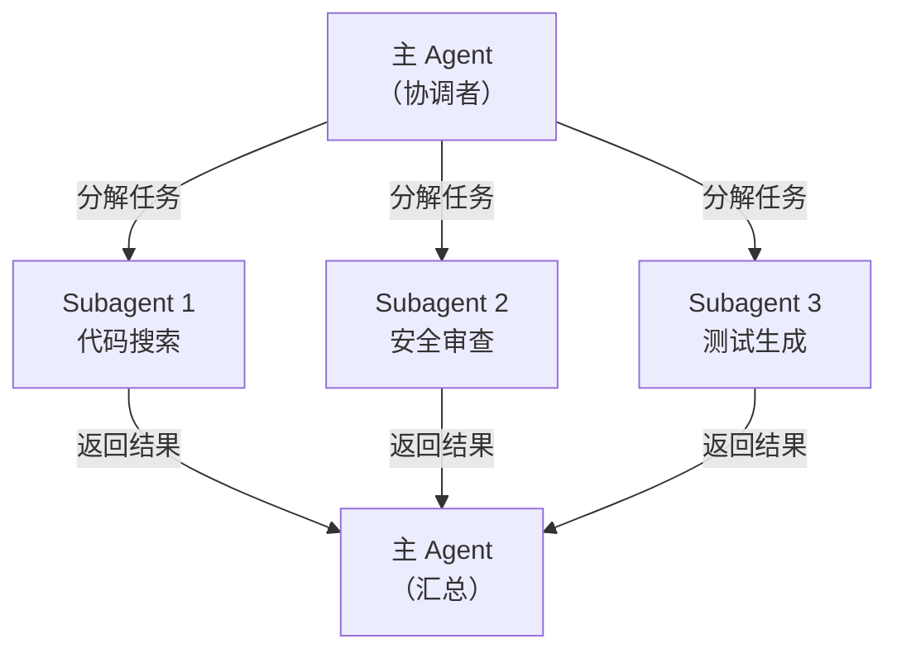

::: warning AI 含量说明
本文由 AI (Claude) 辅助生成，内容经过人工审核与编辑。部分描述可能存在简化表述，请读者结合实际使用体验参考。
:::

# Subagent：Claude Code 的并行任务引擎

::: info 本文概览

- 🎯 **目标读者**：希望加速复杂任务、合理分配模型资源的 Claude Code 用户
- ⏱️ **阅读时间**：约 15 分钟
- 📚 **知识要点**：Subagent 原理、内置 Subagent、自定义 Subagent、并行任务实践、CCR 差异化路由
:::

## 为什么需要 Subagent？

用 Claude Code 处理大型任务时，你可能遇到过这样的情况：要重构一个跨越几十个文件的模块，要同时分析三条数据处理管道，或者要在编写代码的同时审查安全风险——这些任务如果让一个 Agent 串行完成，既慢，上下文也会越积越长，导致前面分析的细节逐渐"遗忘"。

**Subagent** 解决的就是这个问题。它让 Claude Code 可以把任务分解后**并行**交给多个专业化的子代理处理：每个子代理有自己独立的上下文窗口、专属的系统提示和工具权限，互不干扰。主 Agent 只负责分解任务和汇总结果。

这和人类团队协作的逻辑一样：项目负责人把工作拆分给不同专家，各人独立完成，最后集成。

---

## Subagent 的工作原理



**核心机制：**

1. **独立上下文窗口**：每个 Subagent 有自己的上下文，不会被主 Agent 的对话历史填满，也不会被其他 Subagent 的工作干扰
2. **隔离执行**：Subagent 完成任务后，只将最终结果返回给主 Agent，细节过程不会污染主上下文
3. **并行执行**：多个 Subagent 同时运行，最多可有 7 个并行工作
4. **权限继承**：Subagent 继承主 Agent 的权限，但可以通过配置进一步限制可用工具

---

## 内置 Subagent

Claude Code 自带三个内置 Subagent，会在合适时机自动调用：

### Explore（探索）

**定位**：快速、只读的代码库探索代理

**触发时机**：当 Claude 需要搜索或理解代码库，但不需要做任何修改时，自动委托给 Explore。例如："这个项目里所有调用数据库的地方在哪里？"

**特点**：
- 只读权限，不会意外修改文件
- 使用轻量模型（Haiku），速度快、成本低
- 探索结果不进入主上下文，避免无关信息的干扰

**三档力度**：Claude 会根据任务复杂度选择：`quick`（快速浏览）、`medium`（中等深度）、`very thorough`（全面扫描）

### Plan（规划）

**定位**：深度上下文收集代理，服务于 Plan 模式

**触发时机**：当你在 Claude Code 中进入 Plan 模式（`/plan`）时，Plan Agent 负责在正式提出方案前，深入收集和分析相关上下文，确保计划建立在充分理解上。

**特点**：使用高性能模型（Opus/Sonnet），注重推理深度而非速度

### General-Purpose（通用）

**定位**：能处理探索+执行混合任务的全能代理

**触发时机**：对于需要"先理解再动手"的复杂多步骤任务，或有复杂推理需求的场景。

---

## 自定义 Subagent

除内置 Subagent 外，你可以创建自己的专业化 Subagent，为特定任务配备专属的系统提示和工具集。

### 文件格式

自定义 Subagent 是一个带有 YAML 前置元数据的 Markdown 文件：

```markdown
---
name: data-analyzer
description: 当需要分析数据集、生成统计摘要、检查数据质量问题时使用此代理
tools: Read, Write, Bash, Glob
model: sonnet
---

你是一名专业的数据分析专家，擅长处理科学数据集。

## 你的核心职责

- 加载和检查数据文件（CSV、Parquet、NetCDF 等格式）
- 生成描述性统计（均值、标准差、分布、异常值）
- 识别并报告数据质量问题（缺失值、格式错误、范围异常）
- 用简洁的 Markdown 格式输出分析报告

## 工作原则

- 先检查数据的基本信息（shape、dtypes、head）再做分析
- 对数值列默认计算完整的描述性统计
- 发现异常值时，说明具体位置和数量，不要自动删除
- 分析结果保存到 `results/data_report.md`
```

**YAML 字段说明：**

| 字段 | 必填 | 说明 |
|------|------|------|
| `name` | 是 | Subagent 的唯一标识符 |
| `description` | 是 | **最关键字段**，决定 Claude 何时自动调用此代理 |
| `tools` | 否 | 允许使用的工具列表，不填则继承主 Agent 的所有工具 |
| `model` | 否 | 使用的模型（`opus`/`sonnet`/`haiku`/`inherit`），不填默认 `inherit` |

::: tip description 字段的重要性
`description` 决定了 Claude 在什么情况下会自动委托给这个 Subagent。写得越清晰、越具体，Claude 的委托决策越准确。建议用"当……时使用"或"适用于……场景"的句式。
:::

### 存放位置

| 位置 | 作用范围 |
|------|---------|
| `.claude/agents/*.md` | 当前项目可用 |
| `~/.claude/agents/*.md` | 所有项目可用（用户全局） |

Claude Code 启动时自动检测这两个目录中的 `.md` 文件，无需额外注册。

### 创建方式

**方式一：`/agents` 命令（推荐）**

在 Claude Code 交互模式中输入 `/agents`，进入 Subagent 管理界面，可以查看、创建和编辑 Subagent。Claude 会引导你完成配置。

**方式二：手动创建文件**

直接在 `.claude/agents/` 目录下创建 Markdown 文件，按照上面的格式填写即可。

---

## 并行任务实践

### 让 Claude 使用 Subagent

明确告诉 Claude 你希望并行处理：

```
请并行完成以下三项任务：
1. 分析 data/raw/ 下所有 CSV 文件的数据质量
2. 检查 src/ 目录下的代码是否有潜在的内存泄漏
3. 为 tests/ 目录生成测试覆盖率报告

每项任务独立完成，最后汇总给我一份综合报告。
```

Claude 会自动将这三项任务分发给 Subagent（或同时启动多个上下文）并行执行。

### 典型并行场景

**大规模代码重构**：需要在 50 个文件中替换一个废弃函数时，让主 Agent 用 Explore 找出所有调用位置，然后为每个文件启动一个独立 Subagent 执行替换——每个 Subagent 的上下文只包含单个文件，既快速又准确。

**多维度代码审查**：同时启动"代码风格检查"、"安全审查"和"测试覆盖率分析"三个 Subagent 并行审查，比串行逐项检查快 3 倍以上。

**科研数据并行处理**：同时分析多个实验批次的数据，每个批次一个 Subagent，独立生成报告后由主 Agent 汇总对比。

---

## 配合 CCR 实现差异化模型路由

### 问题背景

自定义 Subagent 的 `model` 字段可以指定使用 `opus`、`sonnet` 或 `haiku`。但如果你直连 Anthropic API，这只是在 Claude 系列内部切换，成本差异有限。

当你使用 [CCR（Claude Code Router）](/posts/coding-agent/2026-03-07-claude-code-router) 时，可以将不同模型层级的请求路由到完全不同的服务商，实现更大范围的成本优化：**让轻量 Subagent 走廉价本地模型，让推理密集 Subagent 走高性能 API**。

### CCR 的路由层级

回顾 CCR 的四条路由规则：

```json
"Router": {
    "default":     "deepseek,deepseek-chat",          // 常规任务
    "background":  "ollama,qwen2.5-coder:latest",     // 后台轻量任务
    "think":       "deepseek,deepseek-reasoner",      // 推理密集任务
    "longContext": "openrouter,google/gemini-2.5-pro-preview"  // 超长上下文
}
```

### Subagent model 字段与 CCR 路由的对应关系

Claude Code 根据请求类型将任务分到不同路由：

| Subagent 特征 | Claude Code 发出的请求类型 | CCR 路由槽 |
|---------------|--------------------------|-----------|
| `model: haiku`（轻量任务） | background 类请求 | `background` |
| `model: sonnet` / `model: inherit` | 常规请求 | `default` |
| `model: opus`（推理密集） | 在 Plan 模式下为 think 类请求 | `think` |
| 超长上下文任务（任意模型） | longContext 请求 | `longContext` |

::: info 路由映射的实际行为
CCR 的路由是根据 Claude Code 发出的请求特征（任务类型、上下文长度等）来判断的，而非直接根据 `model` 字段名称映射。实际行为可能因 Claude Code 版本而异。建议通过 `ccr ui`（打开 CCR 的 Web UI）监控实际的路由情况。
:::

### 在提示词中直接指定模型

除了在 Subagent 定义文件中用 `model` 字段声明模型，CCR 还支持另一种更灵活的方式：**在 Subagent 提示词的开头插入路由标记**，实现运行时覆盖，而不影响主会话的路由配置。

```
<CCR-SUBAGENT-MODEL>供应商名,模型名</CCR-SUBAGENT-MODEL>
```

例如，让某个 Subagent 临时使用 OpenRouter 上的特定模型：

```
<CCR-SUBAGENT-MODEL>openrouter,anthropic/claude-3.5-sonnet</CCR-SUBAGENT-MODEL>
请帮我分析这段代码，找出潜在的优化空间...
```

这种方式适合在以下场景精确控制单个 Subagent 的模型分配，而无需改动全局路由配置或重新定义 Subagent 文件：

- 某次任务临时需要某个特定模型的能力
- 对同一个 Subagent 在不同上下文中使用不同模型做对比测试

### 实战配置示例

**场景**：一个科研项目同时有三类 Subagent 需求：
- `file-scanner`：扫描数据目录，任务简单，希望用本地模型节省成本
- `code-analyzer`：分析代码逻辑，常规复杂度，走默认路由
- `experiment-planner`：规划实验方案，需要深度推理，走推理模型

**Subagent 配置：**

`.claude/agents/file-scanner.md`：
```markdown
---
name: file-scanner
description: 当需要扫描目录结构、统计文件数量、列出数据文件时使用
tools: Read, Glob, Bash
model: haiku
---

你是一个高效的文件系统扫描专家。只负责目录扫描和文件统计，不做内容分析。
输出结构化的文件列表和统计信息。
```

`.claude/agents/experiment-planner.md`：
```markdown
---
name: experiment-planner
description: 当需要规划实验设计、分析实验结果、提出改进方案时使用
tools: Read, Write
model: opus
---

你是一名资深科研方法论专家，擅长实验设计和结果解读。

在规划实验前，请先充分理解：
- 研究问题和假设
- 已有的数据和约束
- 计算资源限制

提供详细、可操作的实验方案，包括参数设置理由和预期结果范围。
```

**CCR 配置**（`~/.claude-code-router/config.json`）：
```json
{
  "Providers": [
    {
      "name": "ollama",
      "api_base_url": "http://localhost:11434/v1/chat/completions",
      "api_key": "ollama",
      "models": ["qwen2.5-coder:latest"]
    },
    {
      "name": "deepseek",
      "api_base_url": "https://api.deepseek.com/chat/completions",
      "api_key": "sk-xxx",
      "models": ["deepseek-chat", "deepseek-reasoner"]
    }
  ],
  "Router": {
    "default":    "deepseek,deepseek-chat",
    "background": "ollama,qwen2.5-coder:latest",
    "think":      "deepseek,deepseek-reasoner"
  }
}
```

**实际效果**：
- `file-scanner`（model: haiku）→ background 路由 → 本地 Ollama（免费）
- `code-analyzer`（model: sonnet）→ default 路由 → DeepSeek Chat（低成本）
- `experiment-planner`（model: opus）→ think 路由 → DeepSeek Reasoner（高性能）

这样，同一个项目里，不同复杂度的任务自动走不同的成本层级，无需手动干预。

### 使用 CCR 时启动方式

配置好 CCR 和 Subagent 后，用 `ccr code` 启动 Claude Code：

```bash
ccr code
```

或者在 zcf 中切换到 CCR Proxy 配置后直接用 `claude` 启动（详见 [Part 2](/posts/coding-agent/2026-03-07-claude-code-zcf)）。

---

## 对学术科研用户的价值

**并行数据处理**：实验产出了 10 批数据，每批需要独立清洗和统计分析。用 Subagent 并行处理，时间缩短到原来的 1/5，而不是逐批串行等待。

**多维度文献分析**：同时对一篇长论文的方法论、实验设计和结论部分分别启动 Subagent 并行阅读，最后由主 Agent 生成综合摘要。

**成本控制**：通过 CCR 差异化路由，把文件扫描、格式检查等辅助任务交给本地或廉价模型，把真正需要深度思考的实验规划任务交给高性能模型。这对于 API 额度有限的学生或独立研究者尤其重要。

---

## 小结

Subagent 系统是 Claude Code 从"单线程助手"升级为"多线程团队"的关键机制：

| 功能 | 核心价值 |
|------|---------|
| **内置 Explore** | 自动用轻量模型做只读代码搜索，保持主上下文简洁 |
| **内置 Plan** | 在规划阶段深度收集上下文，避免仓促决策 |
| **自定义 Subagent** | 为特定任务配备专业提示词和工具，提升专项能力 |
| **并行执行** | 独立子任务同时处理，大幅缩短复杂工作的完成时间 |
| **CCR 差异化路由** | 不同复杂度的 Subagent 走不同的模型和服务商，精细控制成本 |

从一个简单的自定义 Subagent 开始——找一个你在项目中频繁重复的操作，把它封装成 Subagent，体验上下文隔离和自动委托带来的效率提升。

## 参考资料

- [Claude Code 官方文档：自定义 Subagent](https://code.claude.com/docs/en/sub-agents)
- [如何用 Claude Code Subagent 并行开发](https://zachwills.net/how-to-use-claude-code-subagents-to-parallelize-development/)
- [Claude Code Agent Teams 完整指南](https://claudefa.st/blog/guide/agents/agent-teams)
- [awesome-claude-code-subagents 社区集合](https://github.com/VoltAgent/awesome-claude-code-subagents)
